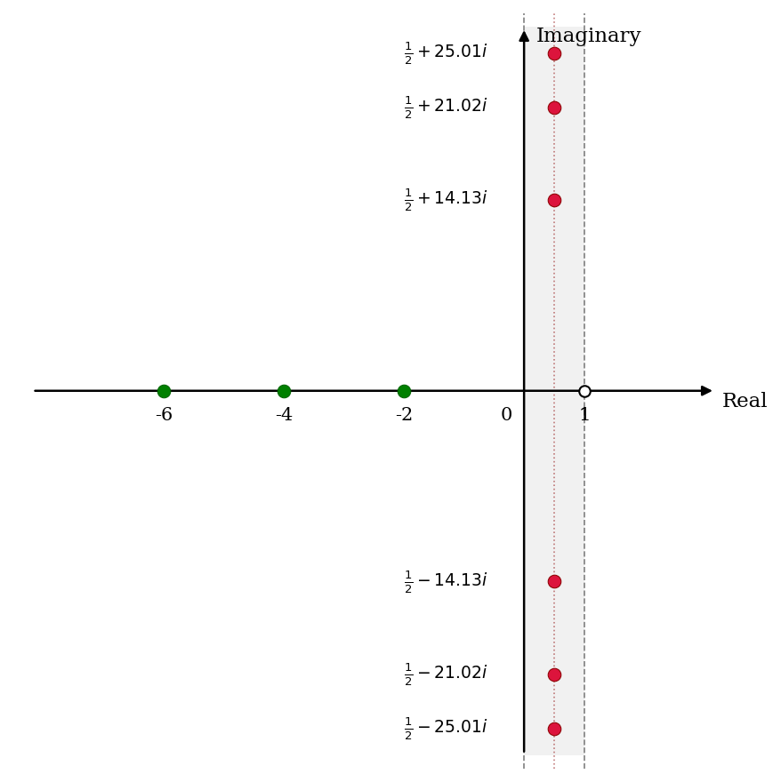
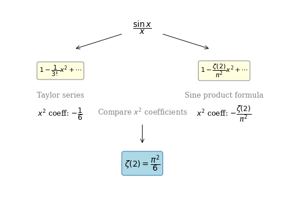
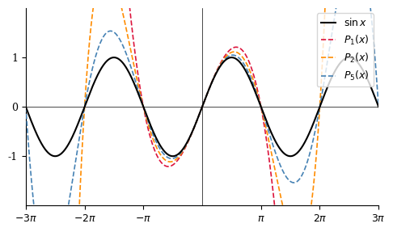

# Intro and the Basel Problem

> Riemann 제타 함수의 기본 성질을 소개하고, Basel 문제 $\zeta(2) = \pi^2/6$을 Euler의 사인 함수 무한 곱 인수분해를 이용하여 증명한다.

- **Source**: [Zeta Explained #001](https://youtu.be/RMFt-9PzF54)
- **Reference**: *The Riemann Zeta-Function* by Aleksandar Ivić (1985)

**Overview**

Riemann 제타 함수를 설명하는 시리즈의 첫 번째 강의이다. 이 시리즈는 기초부터 시작하여, 임계 띠(critical strip) 안에 있는 영점(zero)의 개수를 $0$과 $T$ 사이에서 $O(T \log T)$로 추정하는 Riemann–von Mangoldt 방정식까지 단계적으로 다룬다. 수강자는 미적분학과 복소수에 대한 기본 지식을 갖추고 있다고 가정하며, 복소 해석학(complex analysis)의 관련 개념은 강의 중에 필요에 따라 설명한다. 이 강의에서는 제타 함수의 소개와 Basel 문제의 증명을 다룬다.

**Contents**

- Riemann 제타 함수의 소개 및 복소평면에서의 기본 성질
- 강의 시리즈의 범위: Basel 문제에서 Riemann–von Mangoldt 방정식까지
- Riemann 제타 함수의 정의와 수렴 조건
- $1 + 2 + 3 + 4 + \cdots = -1/12$의 의미와 해석적 연속
- Basel 문제: $\zeta(2) = \pi^2/6$의 소개와 역사적 배경
- 증명의 개요: Taylor 급수와 무한 곱 인수분해의 비교
- 유한한 경우의 함수 인수분해 패턴
- 사인 함수의 무한 곱 인수분해
- 무한 곱 전개와 $x^2$ 계수 추출
- 계수 비교를 통한 Basel 문제 해결

---

## 1. 복소평면에서의 제타 함수

Riemann 제타 함수 $\zeta(s)$는 복소수를 입력받아 복소수를 출력하는 복소 함수이다. 복소수는 2차원 평면, 즉 복소평면(complex plane) 위의 점으로 시각화된다. 복소평면은 수평 방향의 실수축(real axis)과 수직 방향의 허수축(imaginary axis)으로 구성되며, 임의의 복소수 $s = \sigma + it$ ($\sigma, t \in \mathbb{R}$)는 이 평면 위의 한 점에 대응한다. 이 강의 시리즈 전체에 걸쳐 $\zeta(s)$의 입력 공간, 즉 복소평면을 시각화하는 방식으로 논의가 전개된다.

$\zeta(s)$의 두 가지 핵심 성질은 다음과 같다. 첫째, $\zeta(s)$는 $s = 1$에서 극점(pole)을 가진다. 실수 방향으로 $1$, 허수 방향으로 $0$인 점, 즉 $s = 1$에서 함수가 특이점(singularity)을 가진다. 둘째, $\zeta(s) = 0$이 되는 $s$의 값, 즉 제타 함수의 영점(zero)의 분포가 이 시리즈의 핵심 관심사이다.

### 영점의 분류

$\zeta(s)$의 영점은 성질에 따라 두 종류로 구분된다.

**자명한 영점(trivial zero)**은 음의 짝수 정수에 위치하며, 그 존재는 이후 강의에서 엄밀하게 증명된다.

$$
\begin{equation}
\zeta(-2) = \zeta(-4) = \zeta(-6) = \cdots = 0
\end{equation}
$$

**비자명한 영점(nontrivial zero)**은 다음과 같이 정의되는 임계 띠(critical strip) 내부에 무한히 많이 존재한다.

$$
\begin{equation}
0 < \operatorname{Re}(s) < 1
\end{equation}
$$

임계 띠는 $\operatorname{Re}(s) = 0$과 $\operatorname{Re}(s) = 1$을 양 경계로 하는 무한히 긴 수직 띠 영역이다. 비자명한 영점이 이 띠 안에 존재한다는 사실, 그리고 그 개수가 무한하다는 사실은 이후 강의에서 증명된다. 현재까지 수치적으로 확인된 첫 번째 비자명한 영점들은 다음과 같다 (소수점 이하 두 자리로 반올림된 값).

$$
s = \frac{1}{2} \pm 14.13i, \quad
s = \frac{1}{2} \pm 21.02i, \quad
s = \frac{1}{2} \pm 25.01i, \quad \ldots
$$

이 값들은 모두 무리수이며, 그래프에서는 반올림된 근삿값으로 표시된다.

**Figure 1.** 복소평면에서 $\zeta(s)$의 영점 분포

복소평면에서 $\zeta(s)$의 영점 분포를 나타낸다. 자명한 영점(녹색)은 음의 짝수 정수 $s = -2, -4, -6, \ldots$에 위치하며, 비자명한 영점(적색)은 임계 띠 $0 < \operatorname{Re}(s) < 1$ 내부에 무한히 많이 존재한다. 현재까지 수치적으로 확인된 모든 비자명한 영점은 예외 없이 임계선(critical line) $\operatorname{Re}(s) = 1/2$ 위에 위치하며, 그래프에 표시된 허수부 값 $14.13$, $21.02$, $25.01$은 모두 무리수를 반올림한 근삿값이다. 슬라이드에는 이 허수부 값들이 무리수일 것으로 여겨지나 아직 증명되지 않았음을 별도로 강조하고 있다.

### Riemann 가설 (1859)

Riemann 가설(Riemann hypothesis)은 모든 비자명한 영점이 다음 임계선 위에 놓인다고 주장한다.

$$
\begin{equation}
\operatorname{Re}(s) = \frac{1}{2}
\end{equation}
$$

이는 비자명한 영점이 단순히 임계 띠 안에 존재한다는 사실보다 훨씬 강한 주장이다. 현재까지 발견된 모든 비자명한 영점은 Riemann 가설을 만족하지만, 이 명제는 아직 증명되지 않은 추측(conjecture)으로 남아 있다. Clay Mathematics Institute의 밀레니엄 현상금 문제(Millennium Prize Problem) 중 하나로 선정되어, 증명 또는 반례 제시에 100만 달러의 상금이 걸려 있다. 단 하나의 반례, 즉 임계선 위에 놓이지 않는 비자명한 영점을 발견하는 것만으로도 상금 수령이 가능하다.

---

## 2. 강의 시리즈의 범위

본 강의 시리즈는 Basel 문제를 출발점으로 삼아, Ivić(1985)의 저서 1장을 따라 다음 주제들을 순서대로 다룬다.

- Euler 곱 공식(Euler product formula)
- 해석적 연속(analytic continuation)
- $s = 1$에서 $\zeta(s)$의 Laurent 급수
- $\zeta(s)$와 $\zeta(1-s)$를 연결하는 함수 방정식(functional equation)
- Hadamard 곱 공식(Hadamard product formula)
- Riemann–von Mangoldt 방정식
- Riemann 가설과 Lindelöf 가설

이 강의 시리즈를 시작하는 시점에서 위의 용어들이 낯설더라도 전혀 문제가 없다. 시리즈 전체의 목적이 바로 이 개념들을 하나씩 설명하는 것이기 때문이다.

---

## 3. 선수 지식

본 강의 시리즈를 학습하기 위해 필요한 선수 지식은 다음과 같다.

**미적분학**: 증명의 상당 부분이 적분과 무한급수를 포함하므로, 기초 미적분학 지식이 필수적으로 요구된다. 특히 수렴·발산 판정, 급수 전개, 적분 기법에 익숙하여야 한다.

**복소수**: 복소수 $z = a + bi$ ($a, b \in \mathbb{R}$, $i = \sqrt{-1}$)의 기본 개념과 복소평면에서의 해석 방법을 숙지하여야 한다. $e^{i\pi} = -1$과 같은 Euler 공식이 의미하는 바를 직관적으로 이해하고 있을 것을 권장한다.

**복소 해석학**: 강의의 주제 자체가 복소 해석학이므로 사전 지식이 있으면 유리하지만, 반드시 요구되지는 않는다. 강의 방침은 다음과 같다. 복소 해석학의 일반적인 정리는 증명 없이 결과만 인용하고, $\zeta(s)$에 직접 관련된 결과만 상세히 증명한다. 따라서 강의를 수강하며 필요한 내용을 함께 습득하는 것이 가능하다.

---

## 4. 제타 함수의 정의

실수 $s > 1$에서 Riemann 제타 함수는 다음과 같이 정의된다.

$$
\begin{equation}
\zeta(s) = \sum_{n=1}^{\infty} \frac{1}{n^s}
= 1 + \frac{1}{2^s} + \frac{1}{3^s} + \frac{1}{4^s} + \cdots
\end{equation}
$$

변수로 $s$를 사용하는 것은 역사적 관례에 따른 것으로, 일반적인 미적분학에서 사용하는 $x$와 동일한 역할을 한다. 이 급수는 $\operatorname{Re}(s) > 1$을 만족하는 모든 복소수 $s$에 대해 수렴함이 알려져 있으며, 이후 강의에서 해석적 연속을 통해 $s \neq 1$인 모든 복소수로 정의역이 확장된다.

### 특수값

**Basel 문제** ($s = 2$): 자연수의 제곱에 대한 역수의 합으로, 이 강의의 주된 증명 대상이다.

$$
\begin{equation}
\zeta(2) = 1 + \frac{1}{4} + \frac{1}{9} + \frac{1}{16} + \cdots = \frac{\pi^2}{6}
\end{equation}
$$

**극점** ($s = 1$): $s = 1$을 대입하면 조화 급수(harmonic series) $1 + \frac{1}{2} + \frac{1}{3} + \frac{1}{4} + \cdots$가 되어 발산한다. 따라서 $\zeta(s)$는 $s = 1$에서 정의되지 않으며, 이 점이 유일한 극점이다. 정의 자체가 $s > 1$인 경우에만 유효하므로 $s = 1$의 대입은 엄밀히는 허용되지 않지만, 발산의 양상을 이해하기 위한 예시로 제시된다.

$$
\zeta(1) = 1 + \frac{1}{2} + \frac{1}{3} + \frac{1}{4} + \cdots \quad \text{(발산)}
$$

**$s < 1$인 경우**: $s < 1$이면 각 항 $1/n^s$가 $s = 1$에 대응하는 항 $1/n$보다 크거나 같다. 즉,

$$
\frac{1}{n^s} \geq \frac{1}{n} \quad (s \leq 1,\ n \geq 1)
$$

이므로, 비교 판정법(comparison test)에 의해 $s \leq 1$인 모든 실수에 대해 급수가 발산한다. 예를 들어 $s = 0$이면 각 항이 모두 $n^0 = 1$이 되어 급수가 발산함을 직접 확인할 수 있다.

### 해석적 연속과 $\zeta(-1)$

해석적 연속을 통해 $\zeta(s)$를 $s \neq 1$인 모든 복소수로 확장하면, 급수 정의가 발산하는 영역에 있는 $s$에 대해서도 함수값을 부여할 수 있다. 대표적인 예가

$$
\begin{equation}
\zeta(-1) = -\frac{1}{12}
\end{equation}
$$

이다. 이는 2014년 Numberphile의 YouTube 영상을 통해 널리 알려진 결과로,

$$
1 + 2 + 3 + 4 + \cdots = -\frac{1}{12}
$$

와 같이 표현되기도 한다. $\zeta(-1)$에 형식적으로 급수 정의를 적용하면 $1/n^{-1} = n$이므로 $1 + 2 + 3 + \cdots$가 되는데, 이를 $-1/12$와 동치로 표현하는 것은 어디까지나 해석적 연속의 의미에서 성립하는 것이다. 해당 급수가 통상적인 의미에서 수렴한다는 뜻이 아님에 반드시 주의하여야 한다.

---

## 5. Basel 문제

### 역사적 배경

Basel 문제는 Pietro Mengoli(1650)가 최초로 제기한 문제로, 양의 정수의 제곱에 대한 역수의 합이 어떤 값으로 수렴하는지를 묻는다.

$$
\sum_{n=1}^{\infty} \frac{1}{n^2}
= 1 + \frac{1}{4} + \frac{1}{9} + \frac{1}{16} + \cdots = \; ???
$$

이 문제는 약 80년간 미해결로 남아 있다가, Euler(1734–1735)에 의해 최초로 해결되었다.

$$
\begin{equation}
\zeta(2) = \sum_{n=1}^{\infty} \frac{1}{n^2} = \frac{\pi^2}{6}
\end{equation}
$$

Euler의 원래 증명은 현대적 기준에서 완전히 엄밀하다고 보기 어려운 부분을 포함하고 있으나, 핵심 아이디어는 수학적으로 타당하며 깊은 통찰을 담고 있다.

---

## 6. 수치적 근사

Euler는 Basel 문제의 닫힌 형태(closed form)를 추측하기 위해 증명에 앞서 먼저 수치적 근사를 수행하였다. 이는 증명보다 선행된 발견적(heuristic) 접근이었다.

단순한 부분합(partial sum)의 방법은 수렴 속도가 매우 느리다는 문제가 있다. 첫 $10{,}000$항까지 더하면

$$
\sum_{n=1}^{10{,}000} \frac{1}{n^2} = 1.644834\ldots
$$

을 얻는데, 이는 소수점 이하 세 자리만 정확한 값이다. $n^{-2}$의 수렴 속도가 $O(N^{-1})$로 느리기 때문이며, 18세기의 계산 환경에서 수만 개의 항을 손으로 계산하는 것은 사실상 불가능에 가까웠다.

이러한 한계를 극복하기 위해 Euler는 Euler–Maclaurin 합산법(Euler–Maclaurin summation)을 활용하여 소수점 이하 20자리의 정확도를 달성하였다.

$$
\sum_{n=1}^{\infty} \frac{1}{n^2} \approx 1.6449340668482264364\ldots
$$

한편 1730년경에는 이미 $\pi$가 100자리 이상의 정밀도로 계산되어 있었다. Euler는 위에서 얻은 수치와 $\pi^2/6$의 값을 비교하여 이 급수의 합이 $\pi^2/6$임을 추측하였고, 이후 이를 증명하는 데 성공하였다. 결과에 $\pi$가 포함되어 있다는 사실은 사인 함수가 증명의 열쇠가 될 것임을 자연스럽게 암시한다.

---

## 7. Basel 문제의 증명

Euler의 증명은 $\frac{\sin x}{x}$를 두 가지 독립적인 방법으로 전개하고, 양쪽의 $x^2$ 계수를 비교하는 방식으로 이루어진다. 하나는 잘 알려진 Taylor 급수 전개이고, 다른 하나는 $\sin x$의 영점으로부터 구성한 무한 곱 인수분해이다.

**Figure 2.** Euler의 Basel 문제 증명 구조

$\frac{\sin x}{x}$를 두 가지 방식으로 전개하여 $x^2$ 계수를 비교함으로써 $\zeta(2) = \pi^2/6$을 도출하는 증명의 전체 구조를 나타낸다. 왼쪽은 Taylor 급수 전개로부터 $x^2$ 계수가 $-1/3! = -1/6$임을 보이고, 오른쪽은 무한 곱 인수분해로부터 $x^2$ 계수가 $-\zeta(2)/\pi^2$임을 보인다. 두 전개의 $x^2$ 계수를 동치시키면 $\zeta(2) = \pi^2/6$이 즉시 도출된다. 슬라이드에서 무한 곱 인수분해 쪽이 증명의 핵심적이고 어려운 부분으로 강조되어 있다.

### Step 1. $\sin x$의 Taylor 급수

$\sin x$의 Taylor 급수는 다음과 같이 잘 알려져 있다.

$$
\begin{equation}
\sin x = x - \frac{1}{3!}x^3 + \frac{1}{5!}x^5 - \cdots
\end{equation}
$$

양변을 $x$로 나누면

$$
\begin{equation}
\frac{\sin x}{x} = 1 - \frac{1}{3!}x^2 + \frac{1}{5!}x^4 - \cdots
\end{equation}
$$

를 얻는다. $x \to 0$의 극한에서 $\frac{\sin x}{x} \to 1$이므로 이 등식은 $x = 0$에서도 유효하다. 이 전개에서 $x^2$의 계수가 $-1/3! = -1/6$임을 기억한다. 이 계수가 증명의 최종 단계에서 $\zeta(2)$와 직접 비교된다.

### Step 2. $\sin x$의 영점과 도함수 조건

$\sin x$의 영점은 다음과 같다.

$$
\begin{equation}
\sin x = 0 \iff x = n\pi, \quad n \in \mathbb{Z}
\end{equation}
$$

즉, $\sin x$는 $0, \pm\pi, \pm 2\pi, \pm 3\pi, \ldots$에서 영점을 가진다.

또한 $\frac{d}{dx}\sin x = \cos x$이므로 $x = 0$에서의 기울기는 $f'(0) = \cos(0) = 1$이다. 이로부터 $x = 0$ 근방에서 $\sin x \approx x$가 성립하며, $\sin x$의 Taylor 급수는 $x + \cdots$의 형태로 시작한다. 다시 말해 $\frac{\sin x}{x}$의 Taylor 급수는 $1 + \cdots$의 형태로 시작한다.

이 두 조건, 즉 **영점의 위치**와 **$x = 0$에서의 기울기가 $1$이라는 정규화 조건**이 이후 무한 곱 인수분해를 구성할 때 핵심적으로 활용된다. 특히 정규화 조건은 무한 곱에서 임의의 상수 배를 허용하지 않도록 강제하는 역할을 한다. 예를 들어 $\sin x$의 Taylor 급수가 $x + \cdots$가 아니라 $24x + \cdots$로 시작한다면, 무한 곱에 별도의 상수 인수를 도입하여야 하므로 증명이 훨씬 복잡해진다.

> **주의**: 슬라이드의 필기에서 "$\sin x = 0$ if $x = \pi nx$"라는 오기가 강조되어 수정되어 있다. 올바른 조건은 $x = \pi n$이며, $x = \pi nx$가 아님에 주의한다.

### Step 3. 유한한 경우의 인수분해 패턴

무한 곱으로의 확장을 이해하기 위해, 먼저 유한한 경우의 인수분해 패턴을 관찰한다. $x = 0, 1, 2, 3, \ldots$에서 영점을 가지면서 Taylor 급수의 첫 항이 $x$인 다항식을 구성하는 방법을 생각한다.

단순히 $x(x-1)(x-2)\cdots$를 취하면 $x$의 계수가 $n!$으로 성장하여 정규화 조건을 만족하지 않는다. 예를 들어 $x(x-1)(x-2)(x-3)(x-4)$를 전개하면 $x$의 계수가 $24$가 된다. 이를 $n!$로 나누어 $x$의 계수를 $1$로 고정하면 다음과 같은 패턴이 나타난다.

$$
\begin{align*}
\frac{1}{0!} \cdot x &= x \\
\frac{1}{1!} \cdot x(x-1) &= -x + x^2 \\
\frac{1}{2!} \cdot x(x-1)(x-2) &= 2x - 3x^2 + x^3 \\
\frac{1}{3!} \cdot x(x-1)(x-2)(x-3) &= -6x + 11x^2 - 6x^3 + x^4 \\
\frac{1}{4!} \cdot x(x-1)(x-2)(x-3)(x-4) &= 24x - 50x^2 + 35x^3 - 10x^4 + x^5
\end{align*}
$$

$x$의 계수 부호가 인수의 개수에 따라 교대로 나타나는 이유는 다음과 같다. $(x - k)$를 $-(k - x)$로 변환할 때마다 부호가 바뀐다. 인수의 수가 짝수이면 전체 부호가 양수, 홀수이면 음수가 된다. 원하는 것은 $x$의 계수가 항상 양수인 형태이므로, 이 교대하는 부호를 제거하는 방법이 필요하다.

$(x - k)$ 대신 $(1 - x/k)$의 형태를 사용하면 이 문제가 해결된다. 구체적으로, $\frac{1}{k}(k - x) = \left(1 - \frac{x}{k}\right)$이므로 다음과 같이 변환된다.

$$
\begin{equation}
\frac{1}{n!} x(x-1)(x-2)\cdots(x-n+1)
= x \left(1-\frac{x}{1}\right)\!\left(1-\frac{x}{2}\right)\cdots\left(1-\frac{x}{n-1}\right)
\end{equation}
$$

이를 구체적인 예로 확인한다.

$$
\begin{align*}
\frac{1}{4!} x(1-x)(2-x)(3-x)(4-x)
&= \frac{1}{1} \cdot \frac{1}{2} \cdot \frac{1}{3} \cdot \frac{1}{4} \cdot x(1-x)(2-x)(3-x)(4-x) \\
&= x \cdot \frac{1}{1}(1-x) \cdot \frac{1}{2}(2-x) \cdot \frac{1}{3}(3-x) \cdot \frac{1}{4}(4-x) \\
&= x(1-x)\!\left(1-\frac{x}{2}\right)\!\left(1-\frac{x}{3}\right)\!\left(1-\frac{x}{4}\right)
\end{align*}
$$

이 함수는 $x = 0, 1, 2, 3, 4$에서 영점을 가지며, Taylor 급수의 첫 항이 $x$임을 만족한다. 각 인수는 $\left(1 - \frac{x}{\text{영점}}\right)$의 형태를 가지며, 부호는 항상 양수로 유지된다. 이 패턴을 $\sin x$에 적용하는 것이 다음 단계이다.

### Step 4. 사인 함수의 무한 곱 인수분해

$\sin x$는 $x = n\pi$ ($n \in \mathbb{Z}$)에서 영점을 가지고, Taylor 급수의 첫 항이 $x$이다. Step 3의 패턴을 무한한 경우로 확장하면, Euler는 $\sin x$의 인수분해가 다음과 같이 표현된다고 주장하였다.

$$
\begin{align}
\sin x &= x
\left(1 - \frac{x}{\pi}\right)\!\left(1 + \frac{x}{\pi}\right)
\left(1 - \frac{x}{2\pi}\right)\!\left(1 + \frac{x}{2\pi}\right)
\left(1 - \frac{x}{3\pi}\right)\!\left(1 + \frac{x}{3\pi}\right) \cdots \notag \\
&= x \prod_{n=1}^{\infty}\left(1 - \frac{x}{n\pi}\right)\!\left(1 + \frac{x}{n\pi}\right)
\end{align}
$$

양의 영점 $n\pi$에 대응하는 인수 $\left(1 - \frac{x}{n\pi}\right)$와 음의 영점 $-n\pi$에 대응하는 인수 $\left(1 + \frac{x}{n\pi}\right)$를 각각 포함한 것이다. 이제 차이의 곱 공식 $(a-b)(a+b) = a^2 - b^2$을 이용하여 각 쌍을 결합한다.

$$
\left(1 - \frac{x}{n\pi}\right)\!\left(1 + \frac{x}{n\pi}\right) = 1 - \frac{x^2}{n^2\pi^2}
$$

예를 들어 $n = 3$인 경우를 확인하면,

$$
\left(1 - \frac{x}{3\pi}\right)\!\left(1 + \frac{x}{3\pi}\right) = 1 - \frac{x^2}{9\pi^2}
$$

이를 모든 $n$에 대해 적용하면 무한 곱이 다음과 같이 단순화된다.

$$
\begin{equation}
\sin x = x \prod_{n=1}^{\infty}\left(1 - \frac{x^2}{n^2\pi^2}\right)
\end{equation}
$$

양변을 $x$로 나누면 다음을 얻는다.

$$
\begin{equation}
\frac{\sin x}{x} = \prod_{n=1}^{\infty}\left(1 - \frac{x^2}{n^2\pi^2}\right)
= \left(1 - \frac{x^2}{\pi^2}\right)
\!\left(1 - \frac{x^2}{4\pi^2}\right)
\!\left(1 - \frac{x^2}{9\pi^2}\right) \cdots
\end{equation}
$$

이 무한 곱의 유한 항 근사를 그래프로 확인하면 $\sin x$와 매우 잘 일치하며, 항의 수를 늘릴수록 수렴이 개선됨을 확인할 수 있다.

**Figure 3.** 사인 함수의 무한 곱 유한 항 근사와 $\sin x$의 비교

$f(x) = \sin x$ (적색)와 4개의 인수를 사용한 유한 항 근사

$$
g(x) = x\!\left(1 - \frac{x^2}{\pi^2}\right)\!\left(1 - \frac{x^2}{4\pi^2}\right)\!\left(1 - \frac{x^2}{9\pi^2}\right)\!\left(1 - \frac{x^2}{16\pi^2}\right)
$$

(청색)를 겹쳐 나타낸 것이다. $|x|$가 작은 영역에서는 두 함수가 거의 일치하지만, $|x|$가 커질수록 유한 항 근사가 $\sin x$에서 벗어난다. 인수의 수를 늘릴수록 $g(x)$가 $\sin x$에 더 가까워지며, 무한 곱의 극한이 $\sin x$와 정확히 일치함을 시각적으로 뒷받침한다. 슬라이드의 필기에서 이 그래프가 "$\pi$에 가까운 것이 아니라 $\sin x$에 가까운 것"임을 강조하고 있다.

> **주의**: 이 단계는 Euler의 원래 증명에서 엄밀하지 않은 부분이다. 유한한 경우에 성립하는 인수분해를 무한한 경우로 직접 확장하는 것은, 그 자체로는 일반적인 정당화 근거가 없다. 이 단계는 약 140년 후, Weierstrass(1870년대)가 해석 함수에 대한 Weierstrass 인수분해 정리(Weierstrass Factorization Theorem)를 증명함으로써 사후적으로 엄밀하게 정당화되었다. Euler의 증명이 발표된 1734년 시점에는 이 정당화가 존재하지 않았다.

### Step 5. $x^2$ 계수 추출

무한 곱 $\prod_{n=1}^{\infty}\!\left(1 - \frac{x^2}{n^2\pi^2}\right)$를 전개할 때, 각 인수에서 $1$ 또는 $-\frac{x^2}{n^2\pi^2}$ 중 하나를 선택하는 방식으로 항을 구성한다.

- **상수항**: 모든 인수에서 $1$을 선택하면 $1$을 얻는다.
- **$x$ 항**: 각 인수는 $x^2$의 배수를 포함하므로, 어떤 조합으로 선택하더라도 $x^1$의 항을 만들 수 없다. 따라서 $x$ 항은 존재하지 않는다.
- **$x^2$ 항**: 정확히 하나의 인수에서 $-\frac{x^2}{n^2\pi^2}$를 선택하고, 나머지 모든 인수에서 $1$을 선택한 경우만 기여한다.

이를 모든 $n$에 대해 합산하면 다음과 같다.

$$
\begin{align*}
\frac{\sin x}{x}
&= 1 + \left(-\frac{1}{\pi^2} - \frac{1}{4\pi^2} - \frac{1}{9\pi^2} - \cdots\right) x^2 + \cdots \\
&= 1 - \frac{1}{\pi^2}\!\left(1 + \frac{1}{4} + \frac{1}{9} + \cdots\right) x^2 + \cdots \\
&= 1 - \frac{\zeta(2)}{\pi^2}\, x^2 + \cdots
\end{align*}
$$

여기서 $\left(1 + \frac{1}{4} + \frac{1}{9} + \cdots\right) = \sum_{n=1}^{\infty} \frac{1}{n^2} = \zeta(2)$임을 인식하는 것이 증명의 핵심 통찰이다.

### Step 6. 결론: $\zeta(2) = \pi^2/6$

Step 1의 Taylor 급수 전개와 Step 5의 무한 곱 전개에서 $x^2$의 계수를 동치시키면 다음을 얻는다.

$$
\begin{align*}
-\frac{1}{3!} = -\frac{\zeta(2)}{\pi^2}
\quad \Longrightarrow \quad
\frac{\zeta(2)}{\pi^2} = \frac{1}{3!} = \frac{1}{6}
\end{align*}
$$

이로부터 Basel 문제의 해가 도출된다.

$$
\begin{equation}
\zeta(2) = \frac{\pi^2}{6}
\end{equation}
$$

Euler의 실제 논문에서는 이보다 일반화된 방법이 사용되었으며, 각주에서 $\zeta(2)$만을 구하는 더 간결한 방법이 존재함을 언급하고 있다. 위의 증명은 아마도 Euler가 최초로 발견한 방법에 가까운 것으로 추정된다.

---

## 8. 팩토리얼 보충

슬라이드에서 팩토리얼(factorial)을 별도로 소개하고 있다. 양의 정수 $n$에 대해 팩토리얼은 다음과 같이 정의된다.

$$
\begin{equation}
n! = n(n-1)\cdots 2 \times 1
\end{equation}
$$

몇 가지 예를 들면 $1! = 1$, $2! = 2$, $3! = 6$, $4! = 24$이다. 팩토리얼은 점화식 $n! = n \times (n-1)!$을 만족하며, 이를 이용하면 $1! = 1 \times 0!$에서 $0! = 1$임을 도출할 수 있다.

증명의 Step 3에서 $n!$이 분모에 등장하는 이유는, $x(x-1)(x-2)\cdots(x-n+1)$을 전개할 때 $x$의 계수가 $n!$으로 성장하기 때문이다. 이를 $n!$로 나누어 Taylor 급수의 첫 항이 $x$가 되도록 정규화한 것이 인수분해 패턴의 핵심 아이디어이다.

이후 강의에서는 정수가 아닌 복소수에 대해서도 팩토리얼을 일반화한 감마 함수(Gamma function)가 등장하며, 이는 $\zeta(s)$의 해석적 연속을 구성하는 데 필수적인 역할을 한다.

---

## 9. Summary

- Riemann 제타 함수 $\zeta(s)$는 복소수를 입력받는 복소 함수로, 실수 $s > 1$에서 무한급수 $\zeta(s) = \sum_{n=1}^{\infty} 1/n^s$로 정의되며, 해석적 연속을 통해 $s \neq 1$인 모든 복소수로 확장된다.
- $s = 1$은 $\zeta(s)$의 유일한 극점이며, $s \leq 1$인 실수에 대해서는 급수가 발산한다. 비교 판정법에 의해, 조화 급수의 발산으로부터 이 사실이 도출된다.
- 영점은 자명한 영점(음의 짝수 정수)과 임계 띠 $0 < \operatorname{Re}(s) < 1$ 내부에 무한히 존재하는 비자명한 영점으로 구분된다.
- Riemann 가설(1859)은 모든 비자명한 영점이 임계선 $\operatorname{Re}(s) = 1/2$ 위에 놓인다고 주장하는 미증명 추측으로, 증명 또는 반례 발견에 100만 달러의 상금이 걸려 있다.
- Basel 문제 $\zeta(2) = \pi^2/6$은 Mengoli(1650)가 제기하고 Euler(1734–1735)가 해결하였다. Euler는 먼저 Euler–Maclaurin 합산법으로 20자리 정확도의 수치를 얻어 $\pi^2/6$임을 추측한 후 증명을 수행하였다.
- 증명의 핵심은 $\frac{\sin x}{x}$의 Taylor 급수 전개와 무한 곱 인수분해의 $x^2$ 계수를 비교하는 것이다. Taylor 급수에서 $x^2$ 계수는 $-1/6$이고, 무한 곱 전개에서 $x^2$ 계수는 $-\zeta(2)/\pi^2$임을 보여 $\zeta(2) = \pi^2/6$을 도출한다.
- 무한 곱 인수분해의 단계는 Euler 당시에는 엄밀하지 않았으며, Weierstrass 인수분해 정리(1870년대)에 의해 사후적으로 정당화되었다.
- 해석적 연속에 의해 $\zeta(-1) = -1/12$가 성립하며, 이는 $1 + 2 + 3 + \cdots = -1/12$라는 형식적 표현과 연결되지만, 이 급수가 통상적인 의미에서 수렴한다는 뜻이 아님에 주의하여야 한다.

---

## 10. Review Questions

1. Riemann 제타 함수 $\zeta(s)$가 수렴하기 위한 실수 범위의 조건을 서술하고, $s \leq 1$에서 발산하는 이유를 비교 판정법을 이용하여 설명하라.
2. 자명한 영점과 비자명한 영점을 각각 정의하고, 임계 띠와의 관계를 서술하라.
3. 임계 띠와 임계선을 각각 수식으로 정의하고, Riemann 가설이 이 둘과 어떻게 연관되는지 설명하라.
4. $\zeta(-1) = -1/12$가 성립하는 수학적 의미를 해석적 연속의 관점에서 설명하고, 이것이 $1 + 2 + 3 + \cdots = -1/12$를 뜻하지 않는 이유를 서술하라.
5. Euler가 Basel 문제의 답을 추측하기 위해 사용한 수치적 방법을 설명하고, 단순한 부분합 방법의 한계와 Euler–Maclaurin 합산법의 역할을 서술하라.
6. $\sin x$의 영점 위치와 $x = 0$에서의 도함수 조건이 무한 곱 인수분해에서 어떤 역할을 하는지 설명하라. 특히 정규화 조건이 없다면 어떤 문제가 발생하는지 논하라.
7. 유한한 경우의 인수분해 $\frac{1}{n!}x(x-1)\cdots(x-n+1) = x\!\left(1-\frac{x}{1}\right)\!\cdots\!\left(1-\frac{x}{n-1}\right)$이 성립하는 이유를 인수의 부호 변환 관점에서 설명하라.
8. $\sin x$의 무한 곱 인수분해에서 각 쌍 $\left(1 - \frac{x}{n\pi}\right)\!\left(1 + \frac{x}{n\pi}\right)$를 결합하여 $\left(1 - \frac{x^2}{n^2\pi^2}\right)$를 얻는 과정을 서술하라.
9. 무한 곱 $\prod_{n=1}^{\infty}\!\left(1 - \frac{x^2}{n^2\pi^2}\right)$의 전개에서 $x$ 항이 존재하지 않는 이유를 설명하고, $x^2$ 계수를 도출하라.
10. Euler의 사인 함수 무한 곱 인수분해가 당시에 엄밀하지 않았던 이유와, 이것이 이후 어떤 정리에 의해 정당화되었는지 서술하라.