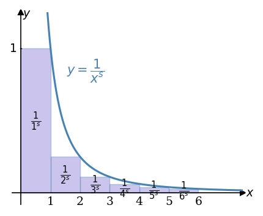
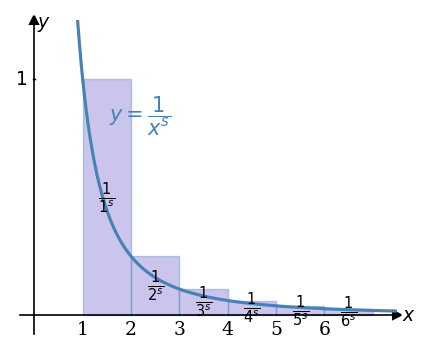
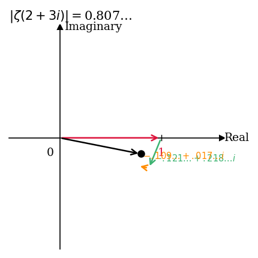
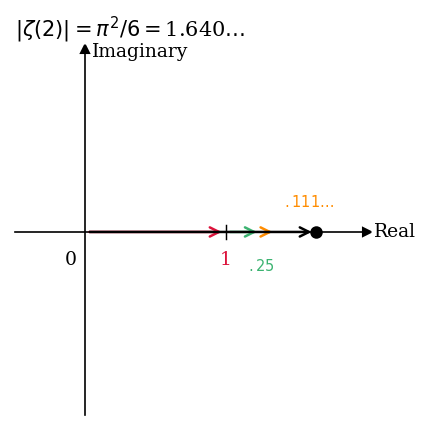
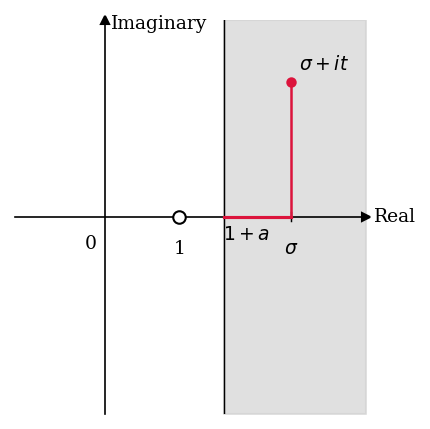

# 2. Zeta in the Complex Plane

> Integral test를 이용하여 $\zeta(s)$가 실수 $s > 1$에서 수렴함을
> 증명하고, 이를 복소수 $s$로 확장하여 $\operatorname{Re}(s) > 1$인 영역에서의
> 수렴성과 $|\zeta(s)|$의 상한을 triangle inequality로 도출한다.

- **Source**: [Zeta Explained #02](https://youtu.be/c0GFNjERKxY?si=Iw5UJmtmfeV0WBQG)
- **Reference**: *The Riemann Zeta-Function* by Aleksandar Ivić (John Wiley & Sons, 1985)

**Overview**

Riemann zeta function을 설명하는 시리즈의 두 번째 강의이다. 먼저 실수 $s > 1$에
대하여 $\zeta(s)$의 급수 정의가 수렴함을 integral test를 이용하여 증명하고,
상한과 하한을 동시에 구한다. 이어서 $s$를 실수 조건에서 $\operatorname{Re}(s) > 1$을
만족하는 복소수로 확장하고, triangle inequality를 이용하여 $|\zeta(\sigma + it)| \leq \zeta(\sigma)$가 성립함을 보인다. 마지막으로 두 부등식을 결합하여
$\operatorname{Re}(s) \geq 1 + a$ ($a > 0$) 영역에서 $|\zeta(s)|$의 상한이
$\zeta(1 + a)$임을 도출한다. 수강자는 calculus와 complex numbers에 대한 기본
지식을 갖추고 있다고 가정하며, complex analysis의 관련 개념은 강의 중에
필요에 따라 설명한다.

**Contents**

- Integral test를 이용한 $\zeta(s)$의 수렴 증명 ($s > 1$)
- 적분 상한 도출: $\sum n^{-s} < 1 + \frac{1}{s-1}$
- 적분 하한 도출: $\sum n^{-s} > \frac{1}{s-1}$
- $s = 1$에서의 발산 및 $\lim_{s \to 1^+} \zeta(s) = \infty$
- 실수 직선 위에서 $\zeta(s)$의 단조 감소성
- $s$를 복소수로 확장: $s = \sigma + it$, $\sigma > 1$
- Triangle inequality를 이용한 $|\zeta(\sigma + it)| \leq \zeta(\sigma)$ 증명
- $e^{i\theta}$의 기하학적 해석과 triangle inequality의 직관적 이해
- $\zeta(2 + 3i)$와 $\zeta(2)$의 복소평면 벡터 합산 시각화
- $\operatorname{Re}(s) \geq 1 + a$ 영역에서 $|\zeta(s)|$의 상한 도출

---

## 1. Convergence of $\zeta(s)$ on Real Numbers

### 정의 및 설정

Riemann zeta function은 실수 $s > 1$에서 다음과 같이 정의된다.

$$
\begin{equation}
\zeta(s) = \sum_{n=1}^{\infty} \frac{1}{n^s}
\end{equation}
$$

이 급수가 $s > 1$인 실수에 대하여 실제로 수렴함을 **integral test**를 이용하여
증명한다. Integral test는 positive-term series의 수렴·발산을 대응하는
이상적분과 비교하여 판정하는 방법이다.

### 상한 도출 (Integral Test — Upper Bound)

$y = x^{-s}$ 곡선 아래에 각 항 $1/n^s$를 높이로 하는 단위 폭의 직사각형을
배치한다. 각 직사각형이 구간 $[n-1, n]$ 위에 세워지면, $x = n$에서의 함수값
$1/n^s$가 직사각형의 높이가 되므로, 직사각형의 면적이 곡선 아래의 넓이보다
작거나 같게 된다. 이 배치에서 $n \geq 2$에 해당하는 직사각형들, 즉 두 번째
직사각형부터 시작하는 합산은 곡선 아래 넓이보다 작다.

$$
\begin{align*}
\sum_{n=1}^{\infty} \frac{1}{n^s} - 1
&= \sum_{n=2}^{\infty} \frac{1}{n^s}
< \int_{1}^{\infty} x^{-s}\, dx
= \left[-\frac{1}{s-1} x^{-s+1}\right]_{1}^{\infty}
= \frac{1}{s-1}
\end{align*}
$$

첫 번째 직사각형의 넓이는 $1/1^s = 1$이므로, 이를 더하면 상한을 얻는다.

$$
\begin{equation}
\sum_{n=1}^{\infty} \frac{1}{n^s} < 1 + \frac{1}{s-1}
\end{equation}
$$

$s > 1$이면 $1/(s-1)$이 유한하므로, 이 부등식은 급수가 수렴함을 보장한다.
또한 모든 항이 양수이므로 이 급수는 **absolutely convergent**하다.

**Figure 1. 적분 판정법 — 상한 도출**

$y = 1/x^s$ 곡선과 각 항 $1/n^s$에 대응하는 직사각형을 나타낸다. 각
직사각형은 구간 $[n-1, n]$ 위에 배치되며, 두 번째 직사각형($n = 2$)부터
시작하는 합이 $\int_1^{\infty} x^{-s}\, dx$보다 작음을 보여준다. 이 관계를
통해 $\sum n^{-s} - 1 < 1/(s-1)$, 즉 급수의 상한이 $1 + 1/(s-1)$임이 도출된다.
슬라이드 하단의 부등식 $\sum_{n=1}^{\infty} n^{-s} - 1 < \int_1^{\infty} x^{-s}\, dx = 1/(s-1)$이 이 관계를 수식으로 정리한 것이다.

### 하한 도출 (Integral Test — Lower Bound)

이번에는 각 직사각형을 구간 $[n, n+1]$ 위에 배치한다. 즉, 직사각형을 오른쪽으로
한 칸씩 이동시킨 형태이다. 이 경우 모든 직사각형을 합산한 넓이가 곡선 아래
넓이보다 크게 된다. 따라서 하한을 얻는다.

$$
\begin{equation}
\sum_{n=1}^{\infty} \frac{1}{n^s} > \int_{1}^{\infty} x^{-s}\, dx = \frac{1}{s-1}
\end{equation}
$$

**Figure 2. 적분 판정법 — 하한 도출**

직사각형을 오른쪽으로 한 칸 이동하여 구간 $[n, n+1]$ 위에 배치한 경우를
나타낸다. 이 배치에서 직사각형 전체의 합산 넓이가 곡선 아래 넓이를 초과하므로,
$\sum_{n=1}^{\infty} n^{-s} > \int_1^{\infty} x^{-s}\, dx = 1/(s-1)$의
하한 부등식이 성립한다. Figure 1과 Figure 2를 결합하면 급수의 상한과 하한이
동시에 확립된다.

### 수렴 결론 및 $s = 1$에서의 거동

상한과 하한을 결합하면 다음의 이중 부등식을 얻는다.

$$
\begin{equation}
\frac{1}{s-1} < \sum_{n=1}^{\infty} \frac{1}{n^s} < 1 + \frac{1}{s-1}
\end{equation}
$$

이 부등식은 $s > 1$인 모든 실수에 대해 급수가 수렴함을 보장한다. 한편
$s \to 1^+$이면 $1/(s-1) \to \infty$이므로 하한이 발산하고, 따라서

$$
\begin{equation}
\lim_{s \to 1^+} \zeta(s) = \infty
\end{equation}
$$

가 성립한다. 극한에 방향 기호 $1^+$를 사용하는 것은, $\zeta(s)$가 급수 정의로는
$s > 1$인 실수에서만 정의되어 있어 $s < 1$에서의 거동이 아직 논의되지 않았기
때문이다.

---

## 2. Zeta on the Real Line

두 실수 $y > x > 1$에 대하여, $\zeta(x)$와 $\zeta(y)$의 각 항을 비교한다.

$$
\zeta(x) = 1 + \frac{1}{2^x} + \frac{1}{3^x} + \cdots, \qquad
\zeta(y) = 1 + \frac{1}{2^y} + \frac{1}{3^y} + \cdots
$$

$y > x > 1$이면 $n^y > n^x$이므로 $n \geq 2$인 모든 $n$에 대해 $1/n^y < 1/n^x$가
성립한다. 따라서 모든 항을 합산하면,

$$
\begin{equation}
\zeta(y) < \zeta(x) \qquad (y > x > 1)
\end{equation}
$$

이 성립한다. 이는 $\zeta(s)$가 실수 $s > 1$의 범위에서 **monotonically
decreasing)**함을 의미한다. 이 결과는 다음 섹션에서 $|\zeta(s)|$의 상한을
확립하는 데 사용된다.

---

## 3. Zeta in the Complex Plane — Definition and Convergence

### 복소수로의 확장

$s$를 실수 조건에서 $\operatorname{Re}(s) > 1$을 만족하는 복소수로 일반화한다.
표준 표기법에 따라 $s$를 실수부와 허수부로 분리하여 다음과 같이 쓴다.

$$
s = \sigma + it, \qquad \sigma, t \in \mathbb{R}, \quad i = \sqrt{-1}
$$

여기서 $\sigma = \operatorname{Re}(s)$는 실수부, $t = \operatorname{Im}(s)$는 허수부이다.
$\operatorname{Re}(s) > 1$이라는 조건은 $\sigma > 1$과 동치이다.

복소수 $s$에 대한 $\zeta(s)$의 정의는 형식적으로 동일하다.

$$
\begin{equation}
\zeta(s) = \sum_{n=1}^{\infty} \frac{1}{n^s}, \qquad \operatorname{Re}(s) > 1
\end{equation}
$$

### 각 항의 전개

$s = \sigma + it$를 대입하여 각 항 $n^{-s}$를 전개한다. 지수 법칙과 $n = e^{\log n}$을 이용하면,

$$
\begin{align*}
\frac{1}{n^s}
&= \frac{1}{n^{\sigma + it}}
= \frac{1}{n^{\sigma} \cdot n^{it}}
= \frac{1}{n^{\sigma}} \cdot n^{-it} \\
&= \frac{1}{n^{\sigma}} \cdot \left(e^{\log n}\right)^{-it}
= \frac{1}{n^{\sigma}} \cdot e^{-it(\log n)}
\end{align*}
$$

여기서 $\log$는 자연로그를 의미한다. 이 강의 시리즈에서 $\log$는 항상 자연로그
$\log_e$를 나타낸다.

### Triangle Inequality를 이용한 수렴 증명

$|\zeta(\sigma + it)|$의 상한을 triangle inequality로 도출한다.

$$
\begin{align*}
|\zeta(\sigma + it)|
&= \left|\sum_{n=1}^{\infty} \frac{1}{n^{\sigma}} e^{-it(\log n)}\right| \\
&\leq \sum_{n=1}^{\infty} \left|\frac{1}{n^{\sigma}} e^{-it(\log n)}\right|
&&\text{(triangle inequality)} \\
&= \sum_{n=1}^{\infty} \left|\frac{1}{n^{\sigma}}\right| \cdot \left|e^{-it(\log n)}\right| \\
&= \sum_{n=1}^{\infty} \frac{1}{n^{\sigma}}
&&\left(\left|e^{-it(\log n)}\right| = 1\right) \\
&= \zeta(\sigma)
\end{align*}
$$

두 번째 줄에서 사용한 triangle inequality는 무한급수에 대한 일반화로,
$\left|\sum a_n\right| \leq \sum |a_n|$이 성립함을 이용한 것이다. 네 번째 줄에서
$\left|e^{-it(\log n)}\right| = 1$이 되는 이유는, $e^{i\theta}$가 복소평면의
unit circle 위의 점을 나타내기 때문이다. 따라서 다음의 핵심 부등식을 얻는다.

$$
\begin{equation}
|\zeta(\sigma + it)| \leq \zeta(\sigma)
\end{equation}
$$

이 부등식은 복소수 입력에서의 $\zeta$ 값의 크기가, 허수부를 제거하고 실수부만
남긴 값에서 계산한 $\zeta$ 값보다 크지 않음을 의미한다. 또한 이미 $\zeta(\sigma)$가
$\sigma > 1$인 실수에 대해 수렴함이 증명되었으므로, $\operatorname{Re}(s) > 1$인
모든 복소수에 대해 $\zeta(s)$가 수렴함이 도출된다.

### $e^{i\theta}$의 기하학적 해석

$e^{i\theta}$는 복소평면에서 원점으로부터 반지름 1, 각도 $\theta$ (반시계 방향)에
위치한 단위원 위의 점이다. 복소수에 $e^{i\theta}$를 곱하는 것은 해당 복소수를
반시계 방향으로 $\theta$ 라디안만큼 회전시키는 연산이다. 따라서 $|e^{i\theta}| = 1$이
항상 성립한다.

---

## 4. Visualization of $\zeta(s)$ for Complex Input

### 벡터 합산으로서의 급수

$\zeta(s)$의 급수를 복소평면에서 벡터들의 순차 합산으로 시각화한다. 각 항
$1/n^s$는 복소평면에서 하나의 벡터(화살표)에 대응한다. 급수의 부분합은 이
벡터들을 순서대로 이어 붙인 것이다.

두 경우 $s = 2 + 3i$와 $s = 2$를 비교한다. 두 경우 모두 실수부가 $\sigma = 2$로
동일하므로, 각 항의 **modulus**는 동일하다. 차이는 허수부 $t$의 유무에
있다.

$s = 2$인 경우, 각 항 $1/n^2$은 양의 실수이므로 모든 벡터가 같은 방향(양의 실수축
방향)을 향한다. 따라서 급수는 단순한 직선 위에서 수렴하며, 그 합은 Basel
problem의 결과인 $\pi^2/6 \approx 1.644$이다.

$s = 2 + 3i$인 경우, 각 항의 크기는 $s = 2$의 대응 항과 동일하지만, 각 항이
$e^{-it(\log n)} = e^{-3i(\log n)}$만큼 회전된다. 두 번째 항은 $3 \log 2$
라디안만큼 회전되고, 세 번째 항은 $3 \log 3$ 라디안만큼 회전된다. 결과적으로
벡터들이 각각 다른 방향을 향하며, 급수는 나선형으로 감기면서 수렴한다.

수렴값은 다음과 같다.

$$
\zeta(2) = \frac{\pi^2}{6} \approx 1.644, \qquad
\zeta(2 + 3i) \approx 0.798 + 0.113i
$$

**Figure 3. 복소평면에서 $\zeta(2 + 3i)$의 벡터 합산**

복소평면에서 $\zeta(2 + 3i)$의 급수를 벡터의 순차 합산으로 나타낸 것이다. 첫째 항은
실수축 위의 $1$에서 시작하며, 이후 각 항이 서로 다른 방향을 향하여 나선형으로
감기면서 수렴점 $\zeta(2 + 3i) \approx 0.798 + 0.113i$에 접근한다. 두 번째 항의
회전각은 $3 \log 2$ 라디안이며, 항이 진행될수록 벡터의 크기는 감소하고 회전이
누적된다. 이 그림은 복소 입력에서의 급수 수렴이 허수부에 의한 회전 효과로
인해 나선형 구조를 띰을 시각적으로 보여준다.

**Figure 4. 복소평면에서 $\zeta(2)$의 벡터 합산**

복소평면에서 $\zeta(2)$의 급수를 벡터의 순차 합산으로 나타낸 것이다. 모든 항
$1/n^2$이 양의 실수이므로 벡터들이 모두 실수축의 양의 방향을 향하며, 부분합이
단조 증가하면서 $\pi^2/6 \approx 1.644$에 수렴한다. $\zeta(2 + 3i)$와 비교하면
각 항의 크기는 동일하지만, 허수부가 없어 회전이 발생하지 않는다. 원점에서
수렴점까지의 거리, 즉 $|\zeta(2)|$가 $|\zeta(2 + 3i)|$보다 큰 것은 triangle
inequality의 등호 조건이 성립하지 않음을 반영한다.

### Triangle Inequality의 기하학적 직관

두 그림은 triangle inequality $|\zeta(\sigma + it)| \leq \zeta(\sigma)$에 대한
기하학적 직관을 제공한다. 각 항의 크기가 동일하더라도, 벡터들이 같은 방향을
향하는 경우($s = 2$)의 합산 크기가 서로 다른 방향을 향하는 경우($s = 2 + 3i$)의
합산 크기보다 크거나 같다. 등호는 모든 벡터가 완전히 같은 방향을 향할 때,
즉 허수부 $t = 0$일 때에만 성립한다.

---

## 5. Bound of $|\zeta(s)|$ in a Half-Plane

### 두 부등식의 결합

앞서 두 가지 부등식을 확립하였다.

- **부등식 (8)**: $|\zeta(\sigma + it)| \leq \zeta(\sigma)$ — triangle inequality로부터
- **부등식 (6)**: $\zeta(y) < \zeta(x)$ ($y > x > 1$) — 단조 감소성으로부터

이 두 부등식을 결합하여 특정 영역에서 $|\zeta(s)|$의 상한을 확정한다.

### 영역 설정

$a > 0$을 고정하고, $\operatorname{Re}(s) \geq 1 + a$를 만족하는 영역,
즉 $\sigma \geq 1 + a$인 반평면을 고려한다. 이 영역에서 $s$를 임의로 선택하면
$\sigma \geq 1 + a > 1$이므로, 단조 감소성에 의해

$$
\zeta(\sigma) \leq \zeta(1 + a)
$$

가 성립한다. 이를 부등식 (8)에 결합하면 transitivity에 의해,

$$
\begin{equation}
|\zeta(s)| = |\zeta(\sigma + it)| \leq \zeta(\sigma) \leq \zeta(1 + a)
\end{equation}
$$

를 얻는다.

**Figure 5. $\operatorname{Re}(s) \geq 1 + a$ 영역에서 $|\zeta(s)|$의 상한**

복소평면에서 $\operatorname{Re}(s) \geq 1 + a$에 해당하는 반평면(회색 영역)을
나타낸다. 이 영역 내의 임의의 점 $\sigma + it$에 대하여, 부등식 (8)에 의해
$|\zeta(\sigma + it)| \leq \zeta(\sigma)$이고, 단조 감소성에 의해 $\zeta(\sigma) \leq \zeta(1 + a)$가 성립한다. 따라서 이 영역 전체에서 $|\zeta(s)|$의 최댓값은
실수축 위의 점 $s = (1 + a) + 0i$에서 달성되며, 그 값은 $\zeta(1 + a)$이다.
$s = 1$은 $\zeta(s)$의 pole로 이 영역에 포함되지 않으며, $a > 0$으로 고정함으로써
singularity를 회피하고 있다.

### 결과의 의미

부등식 (9)는 $\operatorname{Re}(s) \geq 1 + a$ 영역 내에서 $|\zeta(s)|$가
단일 실수값 $\zeta(1 + a)$로 uniform bound됨을 의미한다. 이 영역에서
$|\zeta(s)|$의 최댓값은 허수부 $t$와 무관하게 결정되며, 실수축 위의 점
$s = (1 + a) + 0i$에서 달성된다. 이 결과는 이후 강의에서 $\zeta(s)$의 analytic
properties를 분석할 때 기초가 된다.

---

## 6. Summary

- $\zeta(s)$는 실수 $s > 1$에서 integral test에 의해 수렴하며, 이중 부등식
  $\frac{1}{s-1} < \zeta(s) < 1 + \frac{1}{s-1}$이 성립한다. 모든 항이 양수이므로
  절대수렴한다.
- $s \to 1^+$일 때 $\zeta(s) \to \infty$이므로 $s = 1$은 pole이다. 실수 $s > 1$
  범위에서 $\zeta(s)$는 단조 감소한다.
- $s = \sigma + it$ ($\sigma > 1$)로 일반화하면, triangle inequality에 의해
  $|\zeta(\sigma + it)| \leq \zeta(\sigma)$가 성립하며, $\operatorname{Re}(s) > 1$인
  모든 복소수에 대해 $\zeta(s)$가 수렴함이 도출된다.
- $|\zeta(\sigma + it)| \leq \zeta(\sigma)$의 기하학적 의미는, 복소 입력에서 벡터들이
  서로 다른 방향을 향하여 합산되므로 실수 입력의 경우보다 크기가 작거나 같다는
  것이다. 이는 $\zeta(2 + 3i)$와 $\zeta(2)$의 비교 시각화를 통해 직관적으로 확인된다.
- $a > 0$을 고정하면 $\operatorname{Re}(s) \geq 1 + a$ 영역 전체에서
  $|\zeta(s)| \leq \zeta(1 + a)$의 균등 상한이 성립하며, 최댓값은 실수축 위의
  점 $s = (1 + a) + 0i$에서 달성된다.
- 다음 강의에서는 $\zeta(s)$의 analytic properties, 즉 continuity 및
  differentiability를 분석한다.

---

## 7. Review Questions

1. Integral test를 이용하여 $\zeta(s)$가 실수 $s > 1$에서 수렴함을 증명하라.
   상한과 하한 각각에서 직사각형 배치를 어떻게 달리하는지 설명하라.
2. 이중 부등식 $\frac{1}{s-1} < \zeta(s) < 1 + \frac{1}{s-1}$에서 $s \to 1^+$로
   취할 때 어떤 결론을 얻는가? 극한의 방향을 $1^+$로 한정하는 이유를 설명하라.
3. $\zeta(s)$가 실수 $s > 1$에서 단조 감소임을 항별 비교를 이용하여 증명하라.
4. $s = \sigma + it$로 표기할 때 $\sigma$와 $t$는 각각 무엇을 나타내는가? 이 강의
   시리즈에서 이 표기가 표준으로 사용되는 이유를 설명하라.
5. $n^{-it}$를 $e^{-it(\log n)}$으로 변환하는 과정을 지수 법칙을 이용하여 단계적으로
   설명하라.
6. Triangle inequality $|\zeta(\sigma + it)| \leq \zeta(\sigma)$를 증명하라.
   이 과정에서 $|e^{-it(\log n)}| = 1$이 되는 이유를 기하학적으로 설명하라.
7. $\zeta(2 + 3i)$와 $\zeta(2)$를 복소평면에서 벡터 합산으로 나타낼 때, 두 급수의
   각 항의 크기는 동일하지만 수렴점까지의 거리는 다르다. 그 이유를 triangle
   inequality와 연관지어 설명하라.
8. $e^{i\theta}$의 절댓값이 항상 1인 이유를 기하학적으로 설명하라. 복소수에
   $e^{i\theta}$를 곱하는 것이 어떤 연산에 해당하는가?
9. $a > 0$을 고정할 때 $\operatorname{Re}(s) \geq 1 + a$인 영역에서
   $|\zeta(s)| \leq \zeta(1 + a)$가 성립함을 부등식 (8)과 (6)을 이용하여 증명하라.
   이 영역에서 $|\zeta(s)|$의 최댓값은 어디서 달성되는가?
10. 이번 강의에서 $a > 0$을 먼저 고정하고 $\sigma \geq 1 + a$인 영역을 고려하는
    이유는 무엇인가? $a = 0$으로 설정하면 어떤 문제가 생기는가?