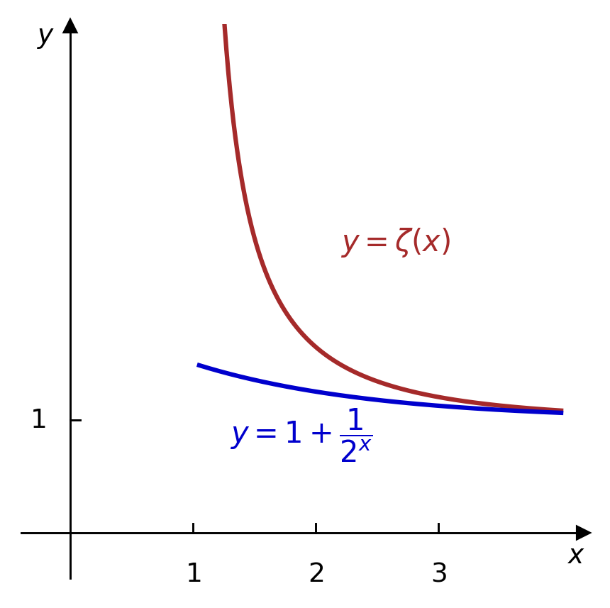
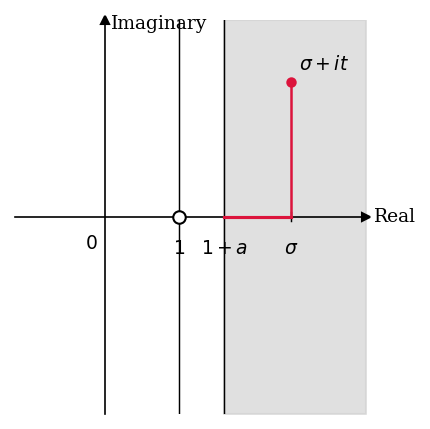
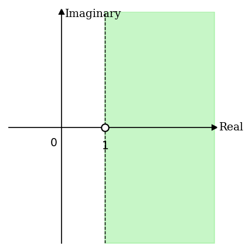

# 3. Analytic Properties of Zeta

> $\operatorname{Re}(s) > 1$에서 $\zeta(s)$의 partial sums가
> $\operatorname{Re}(s) \geq 1 + a$인 영역에서 uniformly convergent함을
> 증명하고, uniform limit theorem을 통해 $\zeta(s)$가 $\operatorname{Re}(s) > 1$에서
> analytic function임을 확립한다.

- **Source**: [Zeta Explained #03](https://youtu.be/BFHXTkVaQAc?si=8yWef6ohl-ufYljs)
- **Reference**: *The Riemann Zeta-Function* by Aleksandar Ivić (John Wiley & Sons, 1985)

**Overview**

Riemann zeta function을 설명하는 시리즈의 세 번째 강의이다. 이 시리즈는
기초부터 시작하여 고급 주제까지 단계적으로 다루며, 수강자는 calculus와
complex numbers에 대한 기본 지식을 갖추고 있다고 가정한다. Complex
analysis의 관련 개념은 강의 중에 필요에 따라 설명한다. 참고 문헌은
Aleksandar Ivić의 *The Riemann Zeta-Function: Theory and Applications*
(John Wiley & Sons, 1985)이다. 이 강의에서는 $\zeta(s)$의 partial sums가
$\operatorname{Re}(s) \geq 1 + a$인 영역에서 uniformly convergent함을
증명하고, 이로부터 $\zeta(s)$가 $\operatorname{Re}(s) > 1$에서 analytic
function임을 보인다.

**Contents**

- 강의 도입: $\operatorname{Re}(s) > 1$에서 $\zeta(s)$의 analytic properties 개요
- Uniform convergence의 정의 및 직관적 설명
- Pointwise convergence와 uniform convergence의 차이
- $x > 1$에서 $\zeta(x)$의 partial sums가 uniformly convergent하지 않음을 보이는 반례
- $\operatorname{Re}(s) \geq 1 + a$에서 partial sums의 uniform convergence 증명
- Complex analysis에서 uniform convergence가 중요한 이유
- Analytic function의 정의 및 예시
- Uniform limit theorem 적용: $\zeta(s)$가 $\operatorname{Re}(s) > 1$에서 analytic임을 결론

---

## 1. 강의 목표와 증명 전략

Riemann zeta function은 $\operatorname{Re}(s) > 1$인 복소수 $s$에 대해 다음과 같이
정의된다.

$$
\begin{equation}
\zeta(s) = \sum_{n=1}^{\infty} \frac{1}{n^s}
\end{equation}
$$

이 강의의 목표는 $\zeta(s)$가 이 영역에서 어떤 analytic properties를 갖는지
규명하는 것이다. 증명은 두 단계로 진행된다.

첫째, $\zeta(s)$의 partial sums로 이루어진 함수열이 $\operatorname{Re}(s) \geq 1 + a$인
영역에서 uniformly convergent함을 보인다. 여기서 $a > 0$은 임의로 고정된
양의 실수이다. $s \to 1$일 때 $\zeta(s) \to \infty$이므로, $s = 1$의
singularity 근방에서의 발산을 피하기 위해 $a > 0$으로 영역의 경계를
$\operatorname{Re}(s) = 1$에서 멀리 떨어뜨린다.

둘째, complex analysis의 uniform limit theorem을 적용하여 $\zeta(s)$가
$\operatorname{Re}(s) > 1$에서 analytic임을 결론 내린다. Analytic function은
단순히 continuous하거나 differentiable한 함수보다 훨씬 강한 조건을
만족하는 함수로, infinitely differentiable하며 complex analysis의 강력한
도구들을 적용할 수 있다.

---

## 2. Uniform Convergence와 Pointwise Convergence

### Partial sums의 정의

$\zeta(s)$의 $n$번째 partial sum을 다음과 같이 정의한다.

$$
\begin{equation}
f_n(s) = \sum_{k=1}^{n} \frac{1}{k^s}
\end{equation}
$$

인덱스 변수로 $k$를 사용하는 것은, $n$이 이미 함수열의 인덱스로 쓰이기
때문이다. 처음 몇 항은 다음과 같다.

$$
f_1(s) = 1, \quad
f_2(s) = 1 + \frac{1}{2^s}, \quad
f_3(s) = 1 + \frac{1}{2^s} + \frac{1}{3^s}, \quad
f_4(s) = 1 + \frac{1}{2^s} + \frac{1}{3^s} + \frac{1}{4^s}
$$

목표는 이 함수열 $\{f_n(s)\}$가 어떤 영역에서 $\zeta(s)$로 uniformly
convergent함을 보이는 것이다.

### Pointwise Convergence와 Uniform Convergence의 차이

두 convergence 개념의 핵심적인 차이는 $\epsilon$과 점의 선택 순서에 있다.

**Pointwise convergence**: 함수열 $f_1, f_2, \ldots$이 $f$로 pointwise
convergent하다는 것은, 점 $x$를 먼저 고정한 후, 임의의 $\epsilon > 0$에
대해 $n \geq N$이면 $|f(x) - f_n(x)| < \epsilon$을 만족하는 $N$이
존재함을 의미한다. 이때 $N$은 $x$에 의존할 수 있다.

**Uniform convergence**: 복소함수열 $\{f_n\}$이 영역 $A$ 위에서 $f$로
uniformly convergent하다는 것은, 임의의 $\epsilon > 0$에 대해 $n \geq N$이면
영역 $A$ 내의 모든 점 $z$에 대해 동시에 $|f(z) - f_n(z)| < \epsilon$을
만족하는 $N$이 존재함을 의미한다.

핵심적인 차이는 $N$의 선택 방식이다. Pointwise convergence에서는 $N$이 점
$x$에 의존할 수 있으나, uniform convergence에서는 $N$이 영역 내의 모든
점에 대해 동시에 유효하여야 한다.

이전 강의에서 integral test를 통해 $x > 1$일 때 $\zeta(x)$가 pointwise
convergent함을 이미 보였다. 그러나 아래에서 확인하듯, $\zeta(x)$의
partial sums는 $x > 1$ 전체에서는 uniformly convergent하지 않다.

---

## 3. $x > 1$에서 Uniform Convergence가 성립하지 않는 반례

$\zeta(x)$의 partial sums가 $x > 1$ 전체 영역에서 uniformly convergent하지
않음을 반례로 보인다. 실수 입력만을 고려한다.

$\epsilon = 0.005$로 고정한다. $f_n(x)$의 각 항은 최대 $1$이므로
$f_n(x) \leq n$이다. 이제 $x = 1 + \frac{1}{n+1}$로 선택하면, 이전
강의의 integral test 결과에 의해

$$
\zeta\!\left(1 + \tfrac{1}{n+1}\right) > n + 1
$$

이 성립한다. 따라서

$$
|\zeta(x) - f_n(x)| \geq (n+1) - n = 1 > 0.005
$$

이므로, 어떤 고정된 $N$을 선택하더라도 $n \geq N$인 $n$에 대해 위 부등식을
만족하는 $x$가 항상 존재한다. 따라서 uniform convergence의 정의를 만족하지
않는다.

이 반례의 근본 원인은 $x = 1$에서의 singularity이다. $x$를 $1$에 임의로
가깝게 선택하면 $\zeta(x)$의 값을 임의로 크게 만들 수 있으므로, $f_n$이
$\zeta$를 균일하게 근사할 수 없다.

**Figure 1. $y = \zeta(x)$와 $y = f_2(x) = 1 + 1/2^x$의 그래프 비교**

실수 $x > 1$에서 $y = \zeta(x)$와 $y = f_2(x) = 1 + 1/2^x$를 함께 나타낸
그래프이다. $\zeta(x)$는 $x \to 1^+$일 때 발산하여 $f_2(x)$와의 차이가
무한히 커지는 반면, $x$가 충분히 크면 두 함수의 차이는 작아진다. 이 그래프는
$x > 1$ 전체 영역에서 partial sums가 uniformly convergent하지 않음을 시각적으로
보여준다. $x = 1$의 singularity 근방에서 임의로 큰 오차가 발생하므로,
모든 $x > 1$에 대해 균일하게 유효한 $N$을 선택하는 것은 불가능하다.

이 문제를 해결하기 위해, $a > 0$을 먼저 고정하고 영역을
$\operatorname{Re}(s) \geq 1 + a$로 제한하면 singularity로부터 충분한
거리를 확보할 수 있다. 다음 섹션에서 이 영역에서의 uniform convergence를
복소수 전체로 확장하여 증명한다.

---

## 4. $\operatorname{Re}(s) \geq 1 + a$에서의 Uniform Convergence 증명

### Step 1: Tail sum $R_n(s)$의 정의

Uniform convergence의 정의에서 $|f(z) - f_n(z)|$에 해당하는 양을 tail sum
$R_n(s)$로 정의한다.

$$
\begin{equation}
R_n(s) = \zeta(s) - f_n(s) = \sum_{k=n+1}^{\infty} \frac{1}{k^s}
\end{equation}
$$

$R_n(s)$는 $\zeta(s)$의 무한급수에서 처음 $n$개의 항을 제거한 나머지
합이다. Uniform convergence를 보이기 위해서는, 임의의 $\epsilon > 0$에 대해
영역 $\operatorname{Re}(s) \geq 1 + a$ 내의 모든 $s$에 대해 $|R_n(s)| < \epsilon$을
만족하는 $N$이 존재함을 보이면 충분하다. 표준 표기에 따라 $s = \sigma + it$로
쓰며, $\sigma = \operatorname{Re}(s)$, $t = \operatorname{Im}(s)$이다. 이
강의에서 $\log$는 자연로그 $\log_e$를 의미한다.

### Step 2: $|R_n(\sigma + it)| \leq R_n(\sigma)$

$s = \sigma + it$로 쓰면 $k^s = k^{\sigma+it} = k^\sigma \cdot k^{it}$이다.
$k = e^{\log k}$임을 이용하여 전개하면,

$$
\begin{align*}
R_n(s)
&= \sum_{k=n+1}^{\infty} \frac{1}{k^{\sigma+it}}
 = \sum_{k=n+1}^{\infty} \frac{1}{k^{\sigma} k^{it}}
 = \sum_{k=n+1}^{\infty} \frac{1}{k^{\sigma}} k^{-it} \\
&= \sum_{k=n+1}^{\infty} \frac{1}{k^{\sigma}} \left(e^{\log k}\right)^{-it}
 = \sum_{k=n+1}^{\infty} \frac{1}{k^{\sigma}} e^{-it(\log k)}
\end{align*}
$$

이제 triangle inequality를 적용한다. $|e^{i\theta}| = 1$이므로
$|e^{-it(\log k)}| = 1$이 성립하며, $\sigma > 1$이면

$$
\begin{align*}
|R_n(\sigma + it)|
&= \left|\sum_{k=n+1}^{\infty} \frac{1}{k^{\sigma}} e^{-it(\log k)}\right|
 \leq \sum_{k=n+1}^{\infty} \left|\frac{1}{k^{\sigma}} e^{-it(\log k)}\right| \\
&= \sum_{k=n+1}^{\infty} \frac{1}{k^{\sigma}} \left|e^{-it(\log k)}\right|
 = \sum_{k=n+1}^{\infty} \frac{1}{k^{\sigma}}
\end{align*}
$$

이므로, 다음이 성립한다.

$$
\begin{equation}
|R_n(\sigma + it)| \leq R_n(\sigma)
\end{equation}
$$

임의의 복소수 $s = \sigma + it$에서 tail sum의 절댓값은 같은 실부 $\sigma$를
갖는 실수에서의 tail sum 값으로 bound된다. 이 단계는 이전 강의에서
$|\zeta(\sigma + it)| \leq \zeta(\sigma)$를 도출한 것과 완전히 동일한
논리 구조이며, 합산의 시작 인덱스만 $n + 1$로 바뀐 것이다.

### Step 3: $R_n(\sigma) \leq R_n(1 + a)$

$\sigma \geq 1 + a$인 실수 $\sigma$에 대해 $R_n(\sigma)$와 $R_n(1 + a)$의
각 항을 비교한다.

$$
R_n(1+a) = \frac{1}{(n+1)^{1+a}} + \frac{1}{(n+2)^{1+a}} + \frac{1}{(n+3)^{1+a}} + \cdots
$$

$$
R_n(\sigma)\ = \frac{1}{(n+1)^{\sigma}} + \frac{1}{(n+2)^{\sigma}} + \frac{1}{(n+3)^{\sigma}} + \cdots
$$

$\sigma \geq 1 + a$이면 각 $k \geq n + 1$에 대해 $k^\sigma \geq k^{1+a}$이므로,

$$
\frac{1}{k^\sigma} \leq \frac{1}{k^{1+a}}
$$

각 항을 비교하면 $R_n(\sigma) \leq R_n(1 + a)$가 성립한다.

### Step 4: Uniform convergence 확립

Step 2와 Step 3를 결합하면, $\sigma = \operatorname{Re}(s) \geq 1 + a$인
임의의 복소수 $s = \sigma + it$에 대해

$$
\begin{equation}
|R_n(\sigma + it)| \leq R_n(\sigma) \leq R_n(1 + a)
\end{equation}
$$

이 성립한다. 이제 고정점 $s = 1 + a$에서의 pointwise convergence를
이용한다. 이전 강의에서 $\operatorname{Re}(s) > 1$이면 $\zeta(s)$가
pointwise convergent함을 integral test로 보였으므로, 임의의 $\epsilon > 0$에
대해

$$
n \geq N \implies R_n(1 + a) < \epsilon
$$

을 만족하는 $N$이 존재한다. 바로 이 $N$을 사용하면, $\operatorname{Re}(s) \geq 1 + a$인
모든 $s$에 대해 동시에

$$
n \geq N \implies |R_n(\sigma + it)| \leq R_n(1+a) < \epsilon
$$

이 성립한다. $N$은 $s$에 의존하지 않으므로 이는 uniform convergence의
정의를 만족한다. 따라서 $f_n(s)$는 $\operatorname{Re}(s) \geq 1 + a$인
영역에서 $\zeta(s)$로 uniformly convergent하다.

**Figure 2. $\operatorname{Re}(s) \geq 1 + a$ 영역에서의 uniform convergence 증명 구조**

복소평면에서 $\operatorname{Re}(s) \geq 1 + a$인 영역(회색 음영)과 임의의
점 $\sigma + it$를 나타낸다. 가로축은 $\operatorname{Re}(s)$, 세로축은
$\operatorname{Im}(s)$이며, $s = 1$은 $\zeta(s)$의 singularity로 영역에
포함되지 않는다. 증명의 핵심 구조는 영역 내 임의의 점 $\sigma + it$에서의
$|R_n(\sigma + it)|$를, 먼저 실수축 위의 $R_n(\sigma)$로, 이어서 경계선
위의 점 $R_n(1 + a)$로 bound하는 부등식 연쇄에 있다. 경계선 위의 고정점
$s = 1 + a$에서의 pointwise convergence 하나만으로 영역 전체의 uniform
convergence를 이끌어낼 수 있으며, 이때 선택된 $N$은 영역 내 모든 $s$에
대해 동시에 유효하다.

---

## 5. $\zeta(s)$의 Analyticity

### Uniform convergence가 중요한 이유

Uniform convergence는 단순한 기술적 조건이 아니라, 수학적으로 유용한
연산을 정당화하는 핵심 조건이다. Uniform convergence가 확보되면 급수와
적분의 순서를 교환하거나, 급수와 미분의 순서를 교환하는 것이 허용된다.

더 나아가 complex analysis의 강력한 도구들은 함수가 analytic하다는 조건을
요구한다. Analytic function은 continuous하거나 단순히 differentiable한
함수보다 훨씬 강한 조건을 만족하며, complex analysis에서 핵심적인 역할을
한다.

### Analytic function의 예시

다음과 같이 익숙한 함수들은 모두 analytic이다.

- 다항식: $z^5 - z^2 + 1$
- $\sin(z)$
- $e^z$
- $n^{-s} = e^{-\sigma(\log n)} e^{-it(\log n)}$ (단, $s = \sigma + it$,
  $\sigma > 1$, $n$은 양의 정수)

두 analytic function의 합, 곱, 합성 역시 analytic이다. 따라서 각
$f_n(s) = \sum_{k=1}^n k^{-s}$는 유한 개의 analytic function의 합으로서
analytic이다.

> **참고**: Weierstrass M-test를 이용하면 위의 증명을 더 간결하게 처리할
> 수 있다. 이 정리는, 영역 $A$ 내의 모든 $n$과 $z$에 대해 $|f_n(z)| \leq M_n$이
> 성립하고 $\sum_{n=1}^{\infty} M_n$이 수렴하면, $\sum_{n=1}^{\infty} f_n(z)$가
> 영역 $A$에서 uniformly convergent함을 주장한다. 강의자는 복소해석학의
> 정리를 연속 적용하기보다 직관을 먼저 구축하고자 직접 증명의 방식을 택하였다.

### Uniform Limit Theorem과 결론

> **주의**: 이하의 uniform limit theorem은 강의에서 증명 없이 인용된다.
> 함수열의 극한이 analytic이 되는 이유를 엄밀히 이해하려면 complex analysis
> 교재를 참고하여야 한다.

**Uniform Limit Theorem**: 함수열 $\{f_n\}$이 analytic functions의 수열이고
어떤 domain 위에서 $f$로 uniformly convergent하면, $f$는 그 domain 위에서
analytic이다.

이를 $\zeta(s)$에 적용한다. 각 partial sum $f_n(s)$는 $\operatorname{Re}(s) > 1$에서
analytic이고, 함수열 $\{f_n(s)\}$는 $\operatorname{Re}(s) \geq 1 + a$에서
$\zeta(s)$로 uniformly convergent함을 보였다. Uniform limit theorem에 의해
$\zeta(s)$는 $\operatorname{Re}(s) \geq 1 + a$에서 analytic이다.

$a > 0$은 임의의 양수이므로 얼마든지 작게 선택할 수 있다. 따라서 $\zeta(s)$는
$\operatorname{Re}(s) > 1$인 영역 전체에서 analytic이다.

**Figure 3. 복소평면에서 $\zeta(s)$가 analytic한 영역 $\operatorname{Re}(s) > 1$**

복소평면에서 $\zeta(s)$가 analytic한 영역 $\operatorname{Re}(s) > 1$(녹색
음영)을 나타낸다. 가로축은 $\operatorname{Re}(s)$, 세로축은
$\operatorname{Im}(s)$이며, 경계선 $\operatorname{Re}(s) = 1$은 점선으로
표시된다. $s = 1$은 $\zeta(s)$의 singularity이므로 영역에 포함되지 않는다.
이 강의에서 확립된 analyticity는 $\operatorname{Re}(s) > 1$로 제한되며,
이후 강의들에서 analytic continuation을 통해 $\zeta(s)$를 복소평면의 나머지
영역으로 확장하게 된다. Figure 2와 비교하면, $a > 0$을 임의로 작게 취하여
$\operatorname{Re}(s) \geq 1 + a$에서의 결론을 열린 반평면
$\operatorname{Re}(s) > 1$ 전체로 확장하는 과정이 이 최종 결론에 반영되어
있다.

---

## 6. Summary

- $\zeta(s)$의 $n$번째 partial sum을 $f_n(s) = \sum_{k=1}^n k^{-s}$로 정의하며,
  $\zeta(s)$는 이 함수열의 극한이다.
- Pointwise convergence에서는 $N$이 점에 의존할 수 있으나, uniform
  convergence에서는 영역 내의 모든 점에 대해 동시에 유효한 $N$을 요구한다.
- $x > 1$ 전체 영역에서는 uniform convergence가 성립하지 않음을 반례로
  보였다. $x = 1 + \frac{1}{n+1}$로 선택하면 $\zeta(x) > n+1$이지만
  $f_n(x) \leq n$이므로, $|R_n(x)| > 1$이 항상 성립하여 uniform convergence의
  정의를 만족할 수 없다.
- $a > 0$을 고정하고 영역을 $\operatorname{Re}(s) \geq 1 + a$로 제한하면,
  tail sum $R_n(s)$에 대한 두 부등식 $|R_n(\sigma+it)| \leq R_n(\sigma) \leq R_n(1+a)$를
  통해 uniform convergence가 성립함을 증명하였다.
- 각 $f_n(s)$는 analytic이고, uniform limit theorem에 의해 그 uniform limit인
  $\zeta(s)$도 $\operatorname{Re}(s) \geq 1 + a$에서 analytic이다.
- $a > 0$이 임의로 작을 수 있으므로, $\zeta(s)$는 $\operatorname{Re}(s) > 1$인
  영역 전체에서 analytic이다.
- 이후 강의들에서는 이 영역에서 $\zeta(s)$의 추가적인 성질을 탐구하고,
  analytic continuation을 통해 복소평면의 나머지 영역으로 확장하는 과정을
  다룬다.

---

## 7. Review Questions

1. Pointwise convergence와 uniform convergence의 정의를 각각 서술하고, 두
   개념의 핵심적인 차이를 $N$의 선택 방식을 중심으로 설명하라.
2. $f_n(s)$가 $\operatorname{Re}(s) > 1$에서 pointwise convergent함은 이전
   강의에서 어떤 도구를 사용하여 보였는가? 그 논리의 핵심을 간략히 설명하라.
3. $\zeta(x)$의 partial sums가 $x > 1$ 전체에서 uniformly convergent하지
   않음을 보이는 반례를 구성하라. $x = 1 + \frac{1}{n+1}$을 선택하면 왜
   $|R_n(x)| > 1$이 성립하는가?
4. Tail sum $R_n(s)$를 정의하고, uniform convergence를 보이기 위해 이 개념을
   도입하는 이유를 설명하라.
5. $|R_n(\sigma + it)| \leq R_n(\sigma)$를 증명하라. 이때 $|e^{-it(\log k)}| = 1$이
   성립하는 이유를 기하학적으로 설명하라.
6. $\sigma \geq 1 + a$일 때 $R_n(\sigma) \leq R_n(1 + a)$가 성립함을 term-by-term
   비교를 통해 보여라.
7. 두 부등식 $|R_n(\sigma+it)| \leq R_n(\sigma)$와 $R_n(\sigma) \leq R_n(1+a)$를
   결합하여 $\operatorname{Re}(s) \geq 1 + a$에서의 uniform convergence 증명을
   완성하라. 이때 고정점 $s = 1 + a$에서의 pointwise convergence가 어떤 역할을
   하는가?
8. Weierstrass M-test를 서술하라. 이 정리를 $\zeta(s)$의 partial sums에 직접
   적용하려면 $M_k$를 어떻게 설정하여야 하는가?
9. Uniform limit theorem을 서술하고, 이를 $\zeta(s)$에 적용하여 $\zeta(s)$가
   $\operatorname{Re}(s) > 1$에서 analytic임을 결론 짓는 논리를 서술하라.
10. $a > 0$이 증명에서 임의로 선택 가능하다는 사실이 왜 $\zeta(s)$가
    $\operatorname{Re}(s) \geq 1 + a$가 아닌 열린 영역 $\operatorname{Re}(s) > 1$
    전체에서 analytic임을 함의하는지 설명하라.