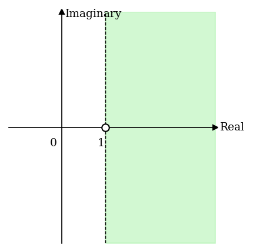

# The Euler Product Formula

> $\zeta(s)$를 모든 소수에 관한 infinite product로 표현하는 Euler product formula를
> 증명하고, multiplicative function과 divisor function $d(n)$을 도입하여
> $\zeta^2(s)$의 Dirichlet series 표현을 유도하며, generalized Euler product formula를
> 엄밀하게 증명한다.

- **Source**: [Zeta Explained #04](https://youtu.be/Gpdr3_GGzww?si=xphMs76m-Y9VplOo)
- **Reference**: *The Riemann Zeta-Function* by Aleksandar Ivić (1985)

**Overview**

Riemann zeta function을 설명하는 시리즈의 네 번째 강의이다. 이 강의에서는 $\zeta(s)$의
series 표현을 소수에 관한 infinite product로 변환하는 Euler product formula를 다룬다.
먼저 geometric series와 fundamental theorem of arithmetic을 이용한 비공식적 증명을
제시하고, 그 한계, 즉 infinite product의 수렴성이 아직 정당화되지 않았음을 지적한다.
이어서 multiplicative function의 개념과 divisor function $d(n)$을 도입하여 $\zeta^2(s)$가
$d(n)$을 numerator로 갖는 Dirichlet series와 같음을 보인다. 마지막으로 multiplicative
function에 관한 generalized Euler product formula를 엄밀하게 증명하고, 이로부터
원래의 Euler product formula의 수렴성까지 포함한 완전한 증명을 완성한다.

**Contents**

- Euler product formula의 소개 및 역사적 배경 (Euler, 1737)
- Geometric series를 이용한 비공식 증명
- Infinite product 전개와 fundamental theorem of arithmetic의 역할
- Multiplicative function의 정의 및 coprime의 예시
- Divisor function $d(n)$과 multiplicativity
- $\zeta^2(s)$의 Dirichlet series 전개 및 $d(n)$과의 연관성
- Dirichlet series의 개념 소개
- Generalized Euler product formula의 진술
- Generalized Euler product formula의 엄밀한 증명

---

## 1. Euler Product Formula

Euler(1737)는 실수 $s > 1$에서 Riemann zeta function이 모든 소수에 관한 infinite
product로 표현됨을 발견하였다.

$$
\begin{equation}
\zeta(s) = \sum_{n=1}^{\infty} \frac{1}{n^s} = \prod_{p} \frac{1}{1 - p^{-s}}
\end{equation}
$$

여기서 $\prod_p$는 모든 소수 $p = 2, 3, 5, 7, 11, \ldots$에 걸친 infinite product를
나타낸다. 이 등식은 analysis의 대상인 $\zeta(s)$와 number theory의 핵심 대상인 소수를
직접 연결한다. 이전 강의에서 $\zeta(s)$가 analytic function임을 보였는데, 이 formula는
$\zeta(s)$와 소수의 분포 사이에 깊은 관계가 있음을 나타내는 첫 번째 단서이다.

---

## 2. 비공식 증명

### Geometric Series의 적용

실수 $|x| < 1$에 대해 다음의 geometric series formula가 성립한다.

$$
\begin{equation}
\frac{1}{1-x} = 1 + x + x^2 + x^3 + \cdots
\end{equation}
$$

소수 $p$에 대해 $x = p^{-s}$로 놓으면, $s > 1$이므로 가장 작은 소수 $p = 2$에서도
$p^s > 2 > 1$이 성립하여 $p^{-s} < 1$임이 보장된다. 따라서 geometric series를
적용할 수 있다.

$$
\frac{1}{1 - p^{-s}} = 1 + \frac{1}{p^s} + \frac{1}{p^{2s}} + \frac{1}{p^{3s}} + \cdots
$$

### Infinite Product의 전개

각 소수에 대한 geometric series를 모두 곱하면 다음과 같이 전개된다.

$$
\prod_{p} \frac{1}{1 - p^{-s}}
= \left(1 + \frac{1}{2^s} + \frac{1}{2^{2s}} + \cdots\right)
\times \left(1 + \frac{1}{3^s} + \frac{1}{3^{2s}} + \cdots\right)
\times \left(1 + \frac{1}{5^s} + \frac{1}{5^{2s}} + \cdots\right)
\times \cdots
$$

이 전개에서 각 항을 수집하는 방식을 관찰한다. 상수항은 각 급수에서 $1$을 선택하면
얻어진다. $1/2^s$는 첫 번째 급수에서 $1/2^s$를 선택하고 나머지에서 $1$을 선택함으로써
얻어진다. $1/4^s = 1/2^{2s}$는 첫 번째 급수에서 $1/2^{2s}$를 선택하면 얻어지고,
$1/6^s$는 첫 번째 급수에서 $1/2^s$, 두 번째 급수에서 $1/3^s$를 선택함으로써 얻어진다.

### Fundamental Theorem of Arithmetic의 역할

**Fundamental theorem of arithmetic** (unique factorization theorem)에 의하면,
1보다 큰 모든 양의 정수는 유일한 prime factorization을 가진다. 임의의 양의 정수 $n$을
소수의 거듭제곱의 곱으로 유일하게 나타낼 수 있으므로, 위의 무한 곱을 전개할 때
$1/n^s$를 얻는 방법은 정확히 하나뿐이다. 따라서 이 무한 곱을 전개하면 각 자연수 $n$에
대응하는 $1/n^s$가 정확히 한 번씩 등장한다.

$$
\prod_{p} \frac{1}{1 - p^{-s}}
= 1 + \frac{1}{2^s} + \frac{1}{3^s} + \frac{1}{4^s} + \frac{1}{5^s} + \frac{1}{6^s} + \cdots
= \sum_{n=1}^{\infty} \frac{1}{n^s}
$$

> **주의**: 이 단계에서는 infinite product가 수렴함을 가정하고 있다. 전개 과정 자체는
> 직관적으로 설득력 있으나, 무한 곱의 수렴성은 아직 증명되지 않은 상태이다. 이를
> 엄밀하게 정당화하는 것이 이 강의의 핵심 목표이며, 이후 generalized Euler product
> formula의 증명을 통해 완성된다.

---

## 3. Multiplicative Functions

### 정의

양의 정수 위에서 정의된 함수 $f(n)$이 **multiplicative**하다는 것은, $m$과 $n$이 coprime,
즉 공통 소인수를 갖지 않을 때마다 다음 조건을 만족함을 의미한다. 이 강의에서는 $f(1) = 1$로
가정한다.

$$
\begin{equation}
f(mn) = f(m)\,f(n), \quad \gcd(m, n) = 1
\end{equation}
$$

### Coprime의 예시

두 수가 coprime인 경우와 그렇지 않은 경우의 예시는 다음과 같다.

- Coprime인 경우: $2$와 $3$, $10 = 2 \times 5$와 $21 = 3 \times 7$, $1$과 $22$
- Coprime이 아닌 경우: $2$와 $10$ (공통 소인수 $2$), $28 = 4 \times 7$과 $21 = 3 \times 7$ (공통 소인수 $7$)

### $n^{-s}$의 Multiplicativity

$\operatorname{Re}(s) > 1$에서 $\zeta(s)$의 각 항에 등장하는 함수 $f(n) = n^{-s}$는
multiplicative function이다. $\gcd(m, n) = 1$이면

$$
f(m)\,f(n) = m^{-s} n^{-s} = (mn)^{-s} = f(mn)
$$

이 지수 법칙에 의해 직접 확인된다.

---

## 4. Divisor Function $d(n)$과 $\zeta^2(s)$

### Divisor Function

양의 정수 $n$의 divisor(약수)의 개수를 나타내는 함수 $d(n)$은 multiplicative function이다.
구체적인 예시로 $n = 3$과 $n = 25$를 고려한다.

- $d(3) = 2$: 약수는 $1, 3$
- $d(25) = 3$: 약수는 $1, 5, 25$
- $d(75) = 6$: 약수는 $1, 3, 5, 15, 25, 75$

$3$과 $25$는 coprime이므로, multiplicativity에 의해 다음이 성립한다.

$$
d(3) \cdot d(25) = 2 \times 3 = 6 = d(75)
$$

$75 = 3 \times 25$의 약수는 $3$의 약수 $\{1, 3\}$와 $25$의 약수 $\{1, 5, 25\}$의 모든
쌍별 곱으로 구성된다. 두 집합의 원소 수의 곱이 $2 \times 3 = 6$인데 이것이 $d(75)$와
일치함을 확인할 수 있으며, 이는 $d$가 multiplicative function임을 직관적으로 뒷받침한다.

### $\zeta^2(s)$의 Dirichlet Series 표현

$\operatorname{Re}(s) > 1$이면 다음이 성립한다.

$$
\begin{equation}
\zeta^2(s) = \sum_{n=1}^{\infty} \frac{d(n)}{n^s}
\end{equation}
$$

이를 확인하기 위해 $\zeta^2(s)$를 Euler product formula를 이용하여 전개한다.

$$
\begin{align*}
\zeta^2(s)
&= \left(\prod_{p} \frac{1}{1 - p^{-s}}\right)^2
= \prod_{p} \left(\frac{1}{1 - p^{-s}}\right)^2
= \prod_{p} \frac{1}{1 - p^{-s}} \cdot \frac{1}{1 - p^{-s}}
\end{align*}
$$

이 이중 product를 각 소수에 대응하는 두 묶음의 급수로 펼치면, $1/n^s$를 얻는 각각의
방법은 두 묶음에서 선택한 항의 곱에 해당한다. 첫 번째 묶음에서 $n$의 약수 $d$에
대응하는 $1/d^s$를 선택하면, 두 번째 묶음에서는 반드시 $1/(n/d)^s$가 선택되어야
$1/d^s \cdot 1/(n/d)^s = 1/n^s$가 성립한다. 따라서 $1/n^s$를 얻는 방법의 수는 $n$의
약수의 수, 즉 $d(n)$과 같다.

예를 들어 $n = 6$의 경우, 약수 $d \in \{1, 2, 3, 6\}$에 대한 네 가지 선택 방법이 있으며,
각각 $(d,\, n/d)$ 쌍 $(1, 6)$, $(2, 3)$, $(3, 2)$, $(6, 1)$에 대응한다. 따라서
$\zeta^2(s)$의 전개에서 $1/6^s$의 계수는 $d(6) = 4$이다.

처음 몇 항의 계수를 정리하면 다음과 같다.

| $n$ | $d(n)$ | 약수 |
|-----|--------|------|
| 1 | 1 | $(1)$ |
| 2 | 2 | $(1, 2)$ |
| 3 | 2 | $(1, 3)$ |
| 4 | 3 | $(1, 2, 4)$ |
| 5 | 2 | $(1, 5)$ |
| 6 | 4 | $(1, 2, 3, 6)$ |

이로부터 $\zeta^2(s)$의 첫 몇 항이 확인된다.

$$
\zeta^2(s) = 1 + \frac{2}{2^s} + \frac{2}{3^s} + \frac{3}{4^s} + \frac{2}{5^s} + \frac{4}{6^s} + \cdots
$$

---

## 5. Dirichlet Series

$\zeta^2(s)$의 분석으로부터 다음과 같이 더 일반적인 급수의 개념이 등장한다.

$$
\sum_{n=1}^{\infty} \frac{a_n}{n^s}
$$

여기서 $a_n$은 $n$의 임의의 함수이다. 이러한 형태의 급수를 **Dirichlet series**라 한다.
$\zeta(s)$는 $a_n = 1$로 놓은 Dirichlet series이며, $\zeta^2(s)$는 $a_n = d(n)$으로 놓은
Dirichlet series이다. Dirichlet series는 analytic number theory에서 핵심적인 역할을
하며, 다양한 수론적 함수를 $s$-영역에서 분석하는 도구로 활용된다.

---

## 6. Generalized Euler Product Formula

### 정리

Euler product formula를 multiplicative function에 대한 일반적인 결과로 확장한다.
$f(n)$이 $f(mn) = f(m)f(n)$ ($\gcd(m,n) = 1$)을 만족하는 실수 또는 복소수값의
multiplicative function이고, $f(1) = 1$이며

$$
\sum_{n=1}^{\infty} |f(n)| < \infty
$$

를 만족한다고 가정한다. 그러면 다음이 성립한다.

$$
\begin{equation}
\sum_{n=1}^{\infty} f(n) = \prod_{p} \bigl(1 + f(p) + f(p^2) + f(p^3) + \cdots\bigr)
\end{equation}
$$

### Euler Product Formula로의 귀결

$\operatorname{Re}(s) > 1$일 때 $f(n) = n^{-s}$는 위의 모든 조건을 만족하는
multiplicative function이므로, 이 정리를 증명하면 Euler product formula가 따라온다.
$f(n) = n^{-s}$를 대입하면, $f(p^k) = p^{-ks}$이므로

$$
\begin{align*}
\sum_{n=1}^{\infty} \frac{1}{n^s}
&= \prod_{p} \bigl(1 + p^{-s} + p^{-2s} + \cdots\bigr)
= \prod_{p} \frac{1}{1 - p^{-s}}
\end{align*}
$$

마지막 등호는 geometric series formula (2)에 의한 것이다.

> **주의**: 이 정리를 증명하는 것은 단순히 Euler product formula만을 증명하는 것보다
> 더 일반적인 결과를 도출하는 것이다. 더 어려운 일반적인 결과를 증명하여 원하는
> 특수한 경우를 얻는 이 전략은 수학에서 흔히 활용된다.

---

## 7. Generalized Euler Product Formula의 증명

### Step 1: 각 인수의 Absolute Convergence

소수 $p$의 거듭제곱들 $p, p^2, p^3, \ldots$는 자연수 전체의 부분집합이다.
가정에 의해 $\sum_{n=1}^{\infty} |f(n)| < \infty$이므로, 이 부분집합에 걸친 합산도
수렴한다.

$$
1 + |f(p)| + |f(p^2)| + \cdots \leq \sum_{n=1}^{\infty} |f(n)| < \infty
$$

따라서 각 소수 $p$에 대해 급수 $1 + f(p) + f(p^2) + \cdots$는 absolutely convergent이다.
Absolute convergence는 유한 개의 이러한 급수를 곱하는 연산이 허용됨을 보장한다.

### Step 2: 유한 Product 근사

목표는 $x \to \infty$ 극한을 통해 infinite product가 수렴함을 보이는 것이다. 먼저
$x$ 이하의 소수만을 포함하는 유한 product를 고려한다.

$$
P(x) = \prod_{p \leq x} \bigl(1 + f(p) + f(p^2) + \cdots\bigr)
$$

Step 1에서 각 인수가 absolutely convergent임을 보였으므로, 유한 개의 인수를 곱하는 것은
허용된다. $P(x)$를 전개할 때, fundamental theorem of arithmetic에 의해 $x$ 이하의 소수만을
prime factor로 갖는 모든 자연수가 정확히 한 번씩 등장한다. 따라서 다음이 성립한다.

$$
P(x) = \sum_{n \leq x} f(n) + R(x)
$$

여기서 $R(x)$는 $n > x$이고, $x$ 이하의 소수만을 prime factor로 갖는 자연수에 대한
$f(n)$의 합이다. 예를 들어 $x = 6$이면 $x$ 이하의 소수는 $2, 3, 5$이고, $P(6)$을
전개하면 $f(1), f(2), \ldots, f(6)$은 $\sum_{n \leq 6} f(n)$에 해당하며,
$f(8), f(9), f(25), \ldots$와 같이 소인수가 $2, 3, 5$뿐인 $6$보다 큰 수들은 $R(6)$에
해당한다. 한편 $f(7)$처럼 $x$보다 큰 소수를 인수로 갖는 수들은 이 전개에 등장하지 않는다.

$R(x)$는 $\sum_{n>x} |f(n)|$에서 일부 항만을 포함하므로,

$$
|R(x)| \leq \sum_{n > x} |f(n)|
$$

이 성립한다.

### Step 3: $R(x) \to 0$의 증명

가정에 의해 $\sum_{n=1}^{\infty} |f(n)| = C < \infty$이다. 수렴하는 급수의 tail sum은
$x \to \infty$일 때 $0$으로 수렴하므로,

$$
\begin{align*}
\lim_{x \to \infty} \sum_{n=1}^{x} |f(n)| &= C \\[4pt]
\implies \lim_{x \to \infty} \left(C - \sum_{n=1}^{x} |f(n)|\right) &= 0 \\[4pt]
\implies \lim_{x \to \infty} \sum_{n > x} |f(n)| &= 0
\end{align*}
$$

이 성립한다. Step 2의 부등식과 결합하면,

$$
\lim_{x \to \infty} |R(x)| \leq \lim_{x \to \infty} \sum_{n > x} |f(n)| = 0
$$

따라서 $\lim_{x \to \infty} R(x) = 0$이 성립한다.

### Step 4: 결론

Step 2의 등식 $P(x) = \sum_{n \leq x} f(n) + R(x)$ 양변에 $x \to \infty$ 극한을 취한다.

$$
\begin{align*}
\lim_{x \to \infty} \prod_{p \leq x} \bigl(1 + f(p) + f(p^2) + \cdots\bigr)
&= \lim_{x \to \infty} \sum_{n \leq x} f(n) + \lim_{x \to \infty} R(x) \\[4pt]
&= \sum_{n=1}^{\infty} f(n) + 0
= \sum_{n=1}^{\infty} f(n)
\end{align*}
$$

좌변의 극한은 infinite product가 수렴함을 보임과 동시에 그 값이 $\sum_{n=1}^{\infty} f(n)$임을
확립한다. 따라서 정리 (5)가 증명된다. $f(n) = n^{-s}$를 대입하면 Euler product formula (1)이
엄밀하게 증명된다.

**Figure 1. Euler product formula가 성립하는 복소평면 영역 $\operatorname{Re}(s) > 1$**

복소평면에서 Euler product formula $\zeta(s) = \prod_p \frac{1}{1 - p^{-s}}$가 성립하는
영역 $\operatorname{Re}(s) > 1$(녹색 음영)을 나타낸다. 가로축은 $\operatorname{Re}(s)$,
세로축은 $\operatorname{Im}(s)$이며, $s = 1$은 $\zeta(s)$의 pole로 열린 원으로 표시된다.
이 강의에서 증명된 generalized Euler product formula는 $\operatorname{Re}(s) > 1$인 영역
전체에서 Euler product의 수렴성과 등식을 동시에 보장한다. 다음 강의에서는 이 formula를
이용하여 $\zeta(s)$가 $\operatorname{Re}(s) > 1$인 영역에서 zero를 갖지 않음을 증명한다.

---

## 8. Summary

- Euler product formula $\zeta(s) = \prod_p \frac{1}{1 - p^{-s}}$는 $\zeta(s)$의 series
  표현과 소수를 직접 연결하며, $\zeta(s)$와 소수 분포 사이에 깊은 관계가 있음을 보여주는
  첫 번째 결과이다.
- 비공식 증명은 geometric series와 fundamental theorem of arithmetic을 이용하지만, infinite
  product의 수렴성은 별도로 정당화되어야 한다.
- Multiplicative function은 $\gcd(m, n) = 1$일 때 $f(mn) = f(m)f(n)$을 만족하는 함수이다.
  $f(n) = n^{-s}$는 대표적인 multiplicative function이다.
- Divisor function $d(n)$은 multiplicative function이며, $\operatorname{Re}(s) > 1$에서
  $\zeta^2(s) = \sum_{n=1}^{\infty} d(n)/n^s$가 성립한다.
- $\zeta^2(s)$에서 $1/n^s$의 계수가 $d(n)$인 이유는, 이중 product에서 $1/n^s$를 얻는
  각각의 방법이 $n$의 약수 $d$를 선택하는 것에 대응하기 때문이다.
- $\sum_{n=1}^{\infty} a_n/n^s$ 형태의 급수를 Dirichlet series라 한다. $\zeta(s)$는
  $a_n = 1$, $\zeta^2(s)$는 $a_n = d(n)$인 Dirichlet series이다.
- Generalized Euler product formula는 $\sum_{n=1}^{\infty} |f(n)| < \infty$를 만족하는
  multiplicative function $f$에 대해 $\sum f(n) = \prod_p (1 + f(p) + f(p^2) + \cdots)$가
  성립함을 주장한다. 이로부터 Euler product formula가 특수한 경우로 얻어진다.
- 증명의 핵심은 유한 product 근사 $P(x) = \sum_{n \leq x} f(n) + R(x)$를 도입하고,
  $\lim_{x \to \infty} R(x) = 0$을 보여 $x \to \infty$ 극한에서 등식을 확립하는 것이다.

---

## 9. Review Questions

1. Euler product formula를 서술하고, 이 공식이 $\zeta(s)$와 소수의 분포 사이의 관계에서
   갖는 의미를 설명하라.
2. Geometric series formula를 이용하여 $\frac{1}{1 - p^{-s}}$를 소수 $p$의 거듭제곱의
   급수로 전개하라. $s > 1$에서 이 전개가 유효한 이유를 설명하라.
3. Fundamental theorem of arithmetic이 Euler product formula의 비공식 증명에서 어떤 역할을
   하는지 설명하라. 이 정리 없이는 $\prod_p (1 - p^{-s})^{-1} = \sum_n n^{-s}$를 주장할
   수 없는 이유를 논하라.
4. Multiplicative function을 정의하고, $f(n) = n^{-s}$가 multiplicative function임을 증명하라.
5. Divisor function $d(n)$이 multiplicative function임을 $n = 3$과 $n = 25$의 예시를 통해
   설명하라. $d(75) = d(3) \cdot d(25)$가 성립하는 이유를 약수의 쌍별 곱의 관점에서
   서술하라.
6. $\zeta^2(s) = \sum_{n=1}^{\infty} d(n)/n^s$가 성립하는 이유를 이중 product에서
   $1/n^s$를 얻는 방법의 수와 $d(n)$의 관계를 중심으로 설명하라.
7. $n = 6$에 대해 이중 product에서 $1/6^s$를 얻는 네 가지 방법을 $(d, n/d)$의 쌍으로
   나열하고, 이것이 $d(6) = 4$임을 확인하라.
8. Dirichlet series를 정의하고, $\zeta(s)$와 $\zeta^2(s)$를 각각 Dirichlet series의
   특수한 경우로 표현하라.
9. Generalized Euler product formula를 진술하고, $f(n) = n^{-s}$를 대입하여 Euler product
   formula를 도출하는 과정을 서술하라.
10. Generalized Euler product formula의 증명에서 remainder term $R(x)$를 정의하고,
    $\lim_{x \to \infty} R(x) = 0$이 성립함을 단계적으로 증명하라.
